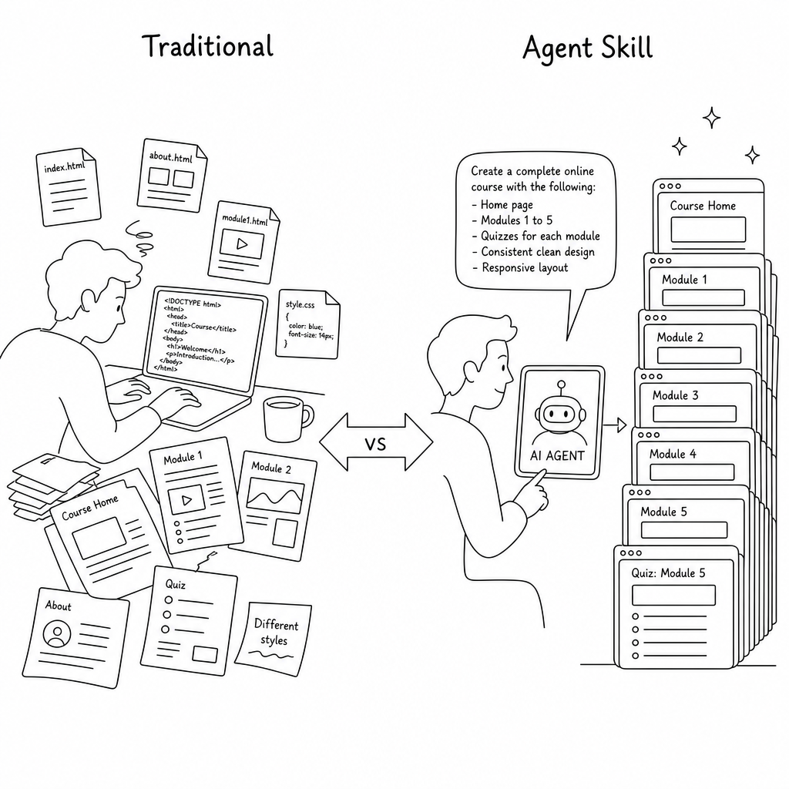
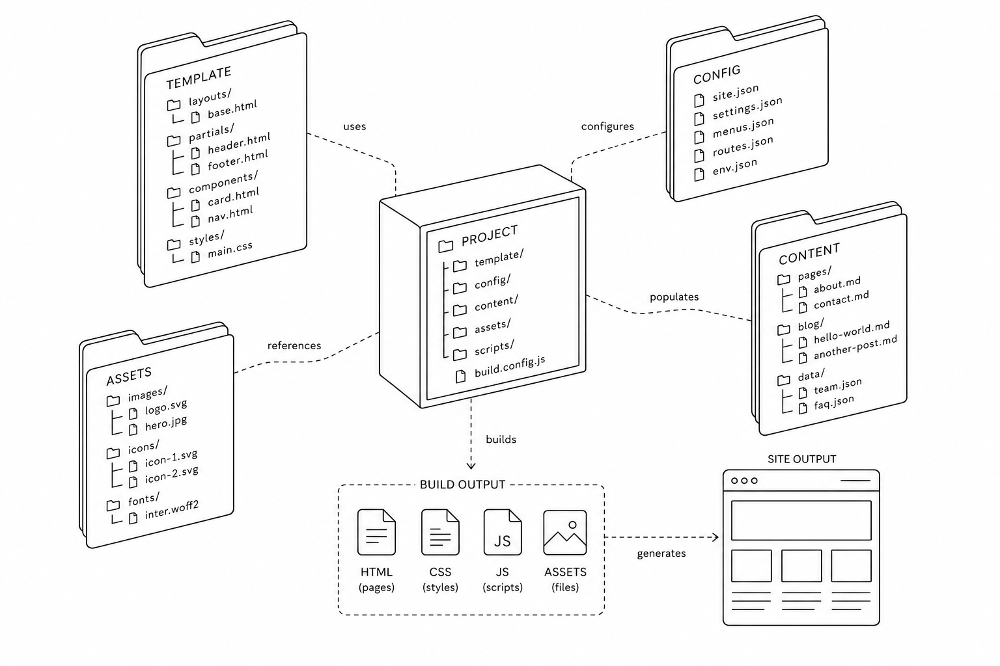
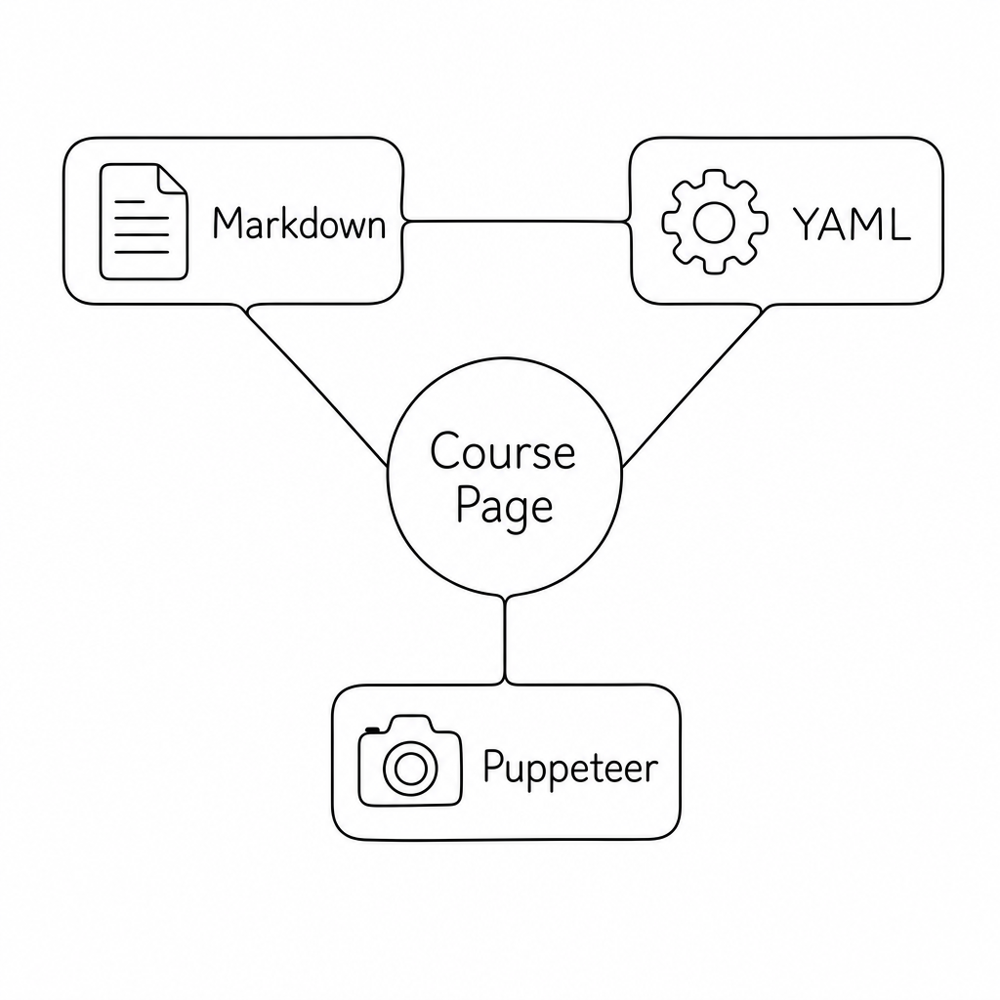
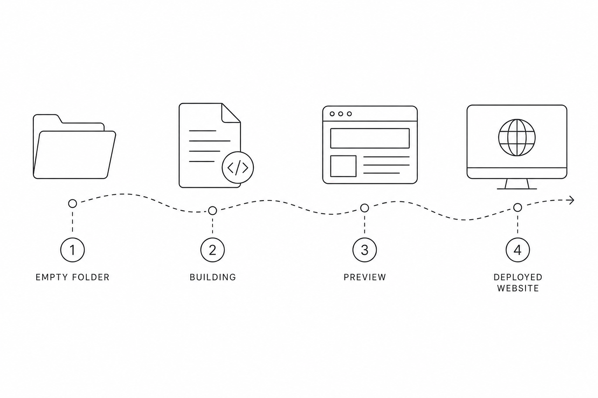
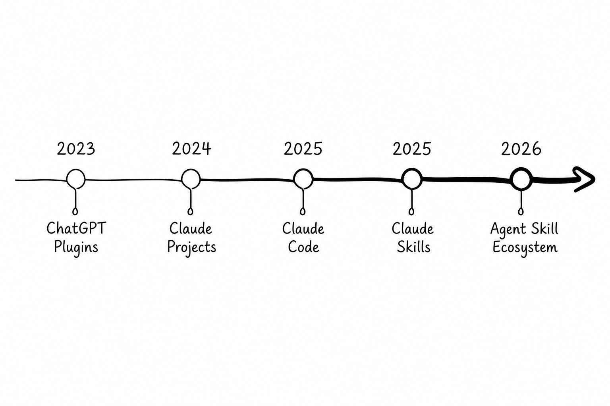
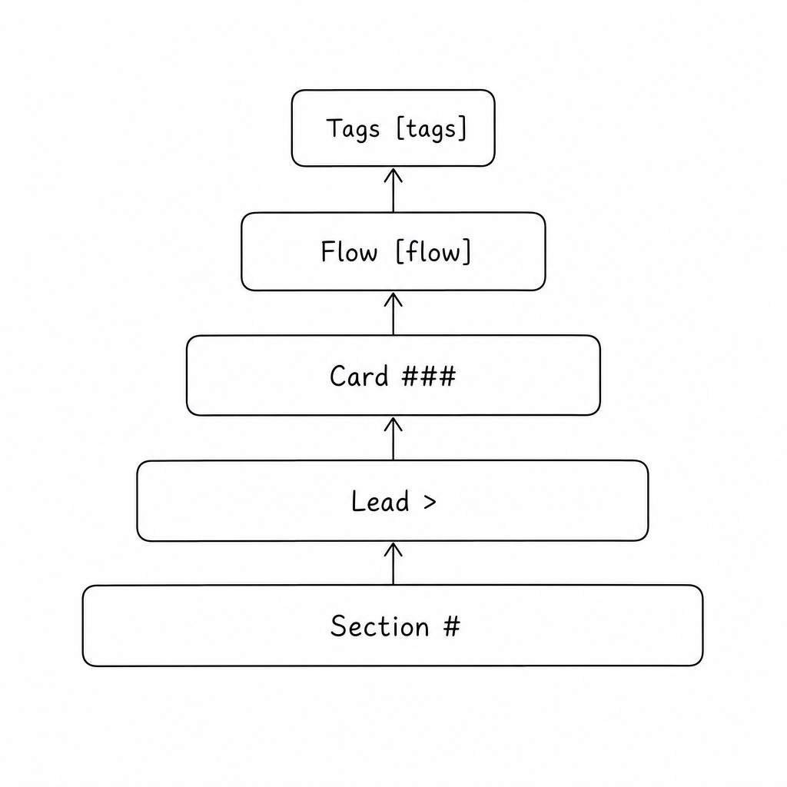
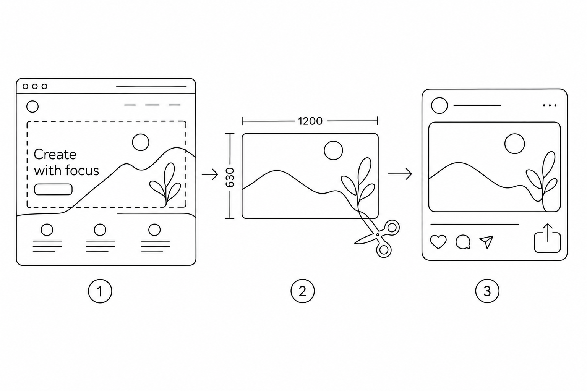
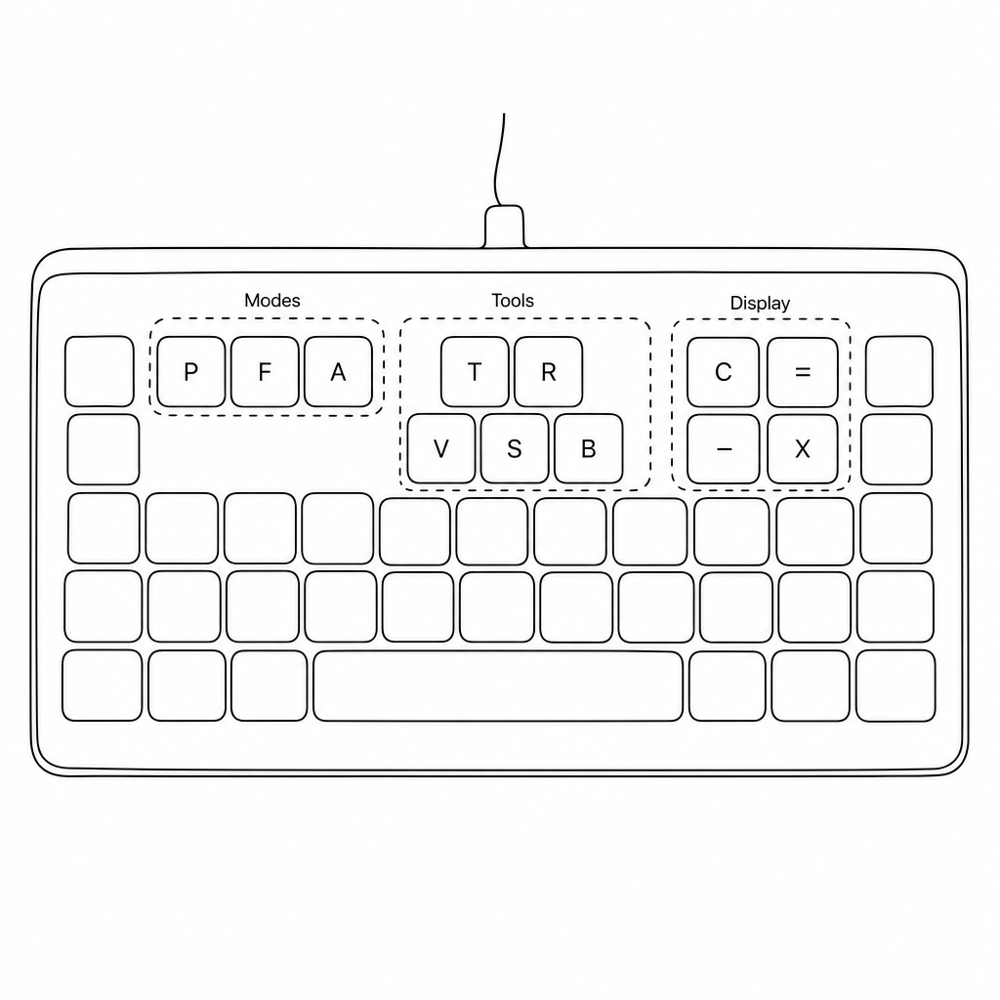
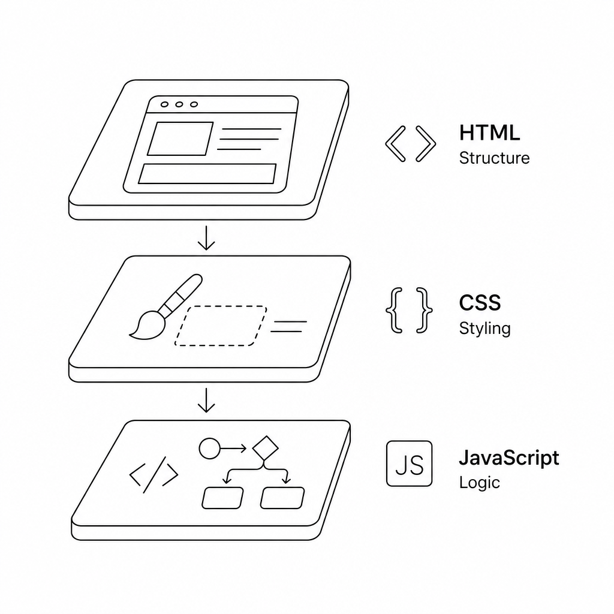
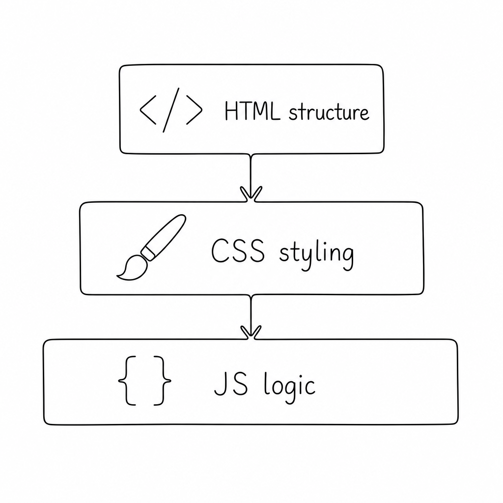

# 快速開始：安裝與第一次使用
> 只需三個步驟，五分鐘內就能生成你的第一份課程頁面


## 前置需求

### 你需要準備

- Node.js 18 以上版本（建議 LTS）
- Git（用於版本控制與 GitHub Pages 部署）
- Claude Code CLI（AI 驅動的核心引擎）

### 傳統課程開發 vs Agent Skill 開發

[compare label-left="傳統課程開發" label-right="Agent Skill 開發"]
- 手動寫 HTML / CSS / JS | 用 content.md 描述內容，AI 自動建置
- 每次風格不一致 | 所有課程共用同一模板與設計語言
- 修改樣式要逐頁調整 | 改 base.html / course.css 一次，全部套用
- 產 OG 圖需要設計軟體 | Puppeteer 自動截取 Hero 區，零設計成本
- 版本差異難以審查 | git diff 清晰可讀，只看內容變化
- 配圖需手動找圖或設計 | AI 自動生成課程配圖，風格統一、批次處理
[/compare]



### 取得專案

```Terminal [label="Terminal"]
git clone https://github.com/mch000534/agent-skill-lecture-builder.git
cd agent-skill-lecture-builder
npm install
```

`npm install` 只需執行一次。唯一的外部相依套件是 Puppeteer，用於自動產生 OG 縮圖。

[callout type="tip" title="提示"]
如果你只是要快速試用，可以先跳過 `npm install`——build 和 dev 都能正常運作。只有在第一次產 OG 縮圖時才需要 Puppeteer。
[/callout]

## 第一次生成課程頁

### 方式一：給主題，讓 AI 從零生成

在 Claude Code 對話窗輸入（自然語言即可）：

```prompt [label="Claude Code"]
扮演一位擅長用實際案例解說的資安專家，
設計「生成式 AI 資訊安全」的講義並生成網頁，完成後直接啟動
```

AI 會依序完成所有步驟，完全不需要手動干預：

[flow]
1. 生成結構化 content.md + config.yaml
2. 批次生成課程配圖（可選）
3. 執行 build.mjs 產出 index.html
4. 執行 generate-og.mjs 產出 OG 縮圖
5. 啟動本機預覽伺服器（port 3000）
[/flow]

### 方式二：給講稿，AI 輔助轉換

已有現成講稿、筆記或投影片大綱？直接貼上：

```prompt [label="Claude Code"]
幫我把這份講稿轉成課程頁面：

（貼上你的講稿內容）
```

AI 會萃取重點、重新結構化，轉為 Markdown 格式並建置頁面。

[reveal title="想一想：為什麼用 Markdown 而不是直接寫 HTML？"]
- 內容與樣式分離，改模板自動套用所有課程
- git diff 清晰可讀，只顯示內容變化
- AI 生成的 Markdown 結構一致，可預期
- 非技術背景的人也能直接編輯內容
[/reveal]

[quiz type="single"]
Q: 第一次建置課程頁面，最少的必要指令是哪幾個？
- [x] build.mjs + generate-og.mjs
- [ ] validate.mjs + dev.mjs
- [ ] build-index.mjs + build-vote.mjs
Hint: build 產出 HTML，generate-og 產出縮圖，這兩步就能上線。
[/quiz]

[quiz type="bool"]
Q: npm install 每次 build 前都需要執行？
- [ ] 是
- [x] 否
Hint: npm install 只需執行一次，安裝 Puppeteer 後即可反覆 build。
[/quiz]

---

# 專案架構：了解每個部分的角色
> 整個系統只有一個 HTML 模板，所有課程共用同一套設計語言



## 目錄總覽

> **核心概念**
> 整個專案只依賴三個核心要素：[?Markdown|一種輕量級標記語言，用簡單的符號表示標題、清單、程式碼等格式] 寫內容、[?YAML|一種人類可讀的資料序列化格式，常用於設定檔] 管設定、[?Puppeteer|Google 開頭的無頭瀏覽器自動化工具，這裡用於自動截取網頁畫面產生 OG 縮圖] 產圖片。

```text [label="專案結構"]
agent-skill-lecture-builder/
├── .agents/skills/course-page-generator/
│   ├── scripts/
│   │   ├── build.mjs          # 主 build script
│   │   ├── dev.mjs            # 含即時重載的開發伺服器
│   │   └── generate-og.mjs    # Puppeteer 截圖產出 OG 圖
│   └── reference/
│       ├── base.html          # 唯一 HTML 模板
│       ├── components.md      # Markdown → HTML 元件對照
│       └── config-example.yaml
├── config/
│   └── global.yaml            # 全域設定（講者、社群、頁尾）
├── lectures/                  # 所有課程放這裡
│   └── <course-dir>/
│       ├── config.yaml        # 課程設定（覆寫全域）
│       ├── content.md         # Markdown 講稿
│       └── index.html         # build 產出（需 commit）
├── assets/
│   ├── course.css             # 所有課程共用 CSS
│   └── course.js              # 計時器、抽籤器、投票等工具
└── index.html                 # 課程目錄索引頁
```



## 兩層設定合併

課程設定採用「全域 + 課程」兩層架構，課程 config 只需寫要覆寫的欄位：

| 層級 | 檔案 | 說明 |
|------|------|------|
| 全域 | config/global.yaml | 講者資訊、社群連結、頁尾、投票後端 |
| 課程 | lectures/課程目錄/config.yaml | 頁面標題、副標題、引言、Badge |

> **陣列欄位整體取代**
> socials、nav 等陣列欄位若在課程 config 中定義，會整體取代全域設定，不做合併。
>
> nav（Hero 導覽按鈕）預設從 content.md 的主章節（`#`）自動產生，通常不需手動設定。

[reveal title="想一想：為什麼不直接合併陣列欄位？"]
如果課程 config 定義了 2 個 nav 按鈕，全域有 5 個——合併後變成 7 個，但講者可能只想顯示自己的 2 個。整體取代讓課程有完全的控制權，避免不相關的按鈕混入。
[/reveal]

---

# 新增課程：從零到上線完整流程
> 四個步驟，從建立目錄到部署至 GitHub Pages



## 步驟一：建立課程目錄

```terminal [label="Terminal"]
mkdir -p lectures/my-course/assets
```

目錄名稱即為課程的 URL 路徑，建議使用小寫英文字母與連字號（kebab-case）。

## 步驟二：撰寫講稿 content.md

在 `lectures/my-course/content.md` 寫入結構化內容（或直接交給 AI 生成）：

```markdown [label="content.md 基本結構"]
# 章節標題：章節副標題
> 章節引言文字

## 子章節

### 卡片標題
- 重點一
- 重點二

[flow]
1. 步驟一
2. 步驟二
[/flow]

---

# 下一個章節
```

完整語法說明見本教材第四章節。

## 步驟三：建立 config.yaml

在 `lectures/my-course/config.yaml` 填入課程基本資訊：

```yaml [label="config.yaml 最小設定"]
page:
  title: "課程名稱"
  badge: "關鍵字 · 標籤"
  hero_title: "英雄區大標題<br>支援換行"
  subtitle: "一句話說明這堂課的價值"

seo:
  title: "SEO 標題（含關鍵字）"
  description: "SEO 描述（120 字以內）"
  image: "https://your-account.github.io/repo/lectures/my-course/assets/og-image.jpg"
  url: "https://your-account.github.io/repo/lectures/my-course/"

quotes:
  opening:
    text: "開場引言"
  closing:
    text: >
      結尾引言，支援 <br> 換行
```

## 步驟四：建置與部署

依序執行以下指令：

[steps-status]
- [done] 環境設定 | 確認 Node.js、Git、Claude Code 已安裝
- [done] 建立課程目錄 | mkdir -p lectures/my-course/assets
- [doing] 撰寫 content.md + config.yaml | 用 AI 生成或手動編寫
- [todo] 生成課程配圖（可選）| 說「幫課程加圖」觸發 image-generator Skill
- [todo] 執行 build + generate-og | 產出 index.html 和 OG 縮圖
- [todo] 更新索引 + commit + push | build-index.mjs 後部署到 GitHub Pages
[/steps-status]

```Terminal [label="Terminal — 建置流程"]
# 1. 建置課程頁
node .agents/skills/course-page-generator/scripts/build.mjs lectures/my-course

# 2. 產生 OG 縮圖（1200x630 px）
node .agents/skills/course-page-generator/scripts/generate-og.mjs lectures/my-course

# 3. 更新根目錄課程索引
node build-index.mjs

# 4. 本機預覽確認
node .agents/skills/course-page-generator/scripts/dev.mjs lectures/my-course
```

確認無誤後 commit 並 push 到 GitHub，GitHub Pages 會自動部署。

> **哪些檔案需要 commit？**
> - lectures/my-course/index.html（build 產出）
> - lectures/my-course/assets/og-image.jpg（OG 縮圖）
> - lectures/my-course/assets/images/（課程配圖）
> - lectures/manifest.js（課程索引）

[callout type="warning" title="注意"]
content.md 和 config.yaml 是**原始檔**，index.html 和 og-image.jpg 是**建置產物**。兩者都需要 commit，因為 GitHub Pages 需要靜態檔案才能正確展示。不要把 index.html 加入 .gitignore。
[/callout]

[quiz type="single"]
Q: 新增課程後，哪一步能讓課程出現在根目錄的索引頁？
- [ ] build.mjs
- [ ] generate-og.mjs
- [x] build-index.mjs
- [ ] dev.mjs
Hint: build-index.mjs 會掃描 lectures/ 目錄產生 manifest.js，索引頁依賴此檔案。
[/quiz]

---

# Markdown 語法：課程內容的積木
> 所有元件都是純 Markdown 語法，AI 可以直接生成，你也可以手寫


## Agent Skill 技術演進



```markdown [label="語法"]
[timeline]
- 2023 | ChatGPT Plugins | AI 首次能呼叫外部 API，但依賴單一平台
- 2024 | Claude Projects | 上傳文件作為知識庫，但仍是被動問答
- 2025 | Claude Code | 終端機原生 AI 編程助手，能讀寫檔案、執行指令
- 2025 | Claude Skills | 可封裝、可分享的自訂工作流，AI 能力可組合
- 2026 | Agent Skill Ecosystem | 社群共享 Skill，一鍵安裝複雜工作流
[/timeline]
```

[timeline]
- 2023 | ChatGPT Plugins | AI 首次能呼叫外部 API，但依賴單一平台
- 2024 | Claude Projects | 上傳文件作為知識庫，但仍是被動問答
- 2025 | Claude Code | 終端機原生 AI 編程助手，能讀寫檔案、執行指令
- 2025 | Claude Skills | 可封裝、可分享的自訂工作流，AI 能力可組合
- 2026 | Agent Skill Ecosystem | 社群共享 Skill，一鍵安裝複雜工作流
[/timeline]

> **從「對話」到「技能」的關鍵轉變**
> 過去我們用自然語言跟 AI 對話，每次結果都不同。Skill 把成功的工作流封裝起來，讓任何人都能重現一致的產出——這才是可規模化的教學工具。

## 結構元件



### 內容輸入方式比較

```markdown [label="語法"]
[compare-table headers="方式 | **推薦：AI 生成** | 手動編寫"]
- 速度 | 幾秒內產出完整草稿 | 需要熟悉語法與排版
- 一致性 | AI 自動遵循 components.md 規範 | 容易遺漏元件語法
- 適合場景 | 新課程快速起步 | 現有課程精修調整
- 門檻 | 只需會下 Prompt | 需要了解 Markdown 擴充語法
- 維護性 | 生成的內容可手動二次編輯 | 完全掌控每個細節
[/compare-table]
```

[compare-table headers="方式 | **推薦：AI 生成** | 手動編寫"]
- 速度 | 幾秒內產出完整草稿 | 需要熟悉語法與排版
- 一致性 | AI 自動遵循 components.md 規範 | 容易遺漏元件語法
- 適合場景 | 新課程快速起步 | 現有課程精修調整
- 門檻 | 只需會下 Prompt | 需要了解 Markdown 擴充語法
- 維護性 | 生成的內容可手動二次編輯 | 完全掌控每個細節
[/compare-table]

### 主章節與子章節

```markdown [label="語法"]
# LABEL：TITLE         ← 主章節（全形冒號）
> 緊接 # 的引言文字    ← 章節引言（自動套用 lead 樣式）

## 子章節標題

### 卡片標題            ← 自動套用卡片外框
```

### 流程步驟

```markdown [label="語法"]
[flow]
1. 第一步驟
2. 第二步驟
3. 第三步驟
[/flow]
```

[flow]
1. 流程步驟一：說明文字
2. 流程步驟二：說明文字
3. 流程步驟三：說明文字
[/flow]

### 標籤區塊

```markdown [label="語法"]
[tags]
- [green] 成功 / 完成類
- [orange] 警告 / 注意類
- [purple] 特色 / 亮點類
- [blue] 資訊 / 說明類
- [red] 錯誤 / 禁止類
[/tags]
```

[tags]
- [green] 綠色：成功、完成、推薦
- [orange] 橘色：警告、注意、限制
- [purple] 紫色：進階、特色、亮點
- [blue] 藍色：資訊、說明、提示
[/tags]

### Insight Box（洞察框）

```markdown [label="語法"]
> **粗體標題**
> 內文說明，支援多行。
> 第二行繼續。
```

> **Insight Box 呈現效果**
> 用於補充說明、重要提醒或背景知識。以粗體開頭即可自動套用樣式，不需任何 class 設定。

## 終端機 / Prompt 區塊

````markdown [label="語法"]
```markdown [label="自訂標籤"]
指令或程式碼內容
```
````

- 標籤文字顯示在區塊右上角
- 自動套用深色背景與等寬字型
- 支援多行，長行自動橫向捲動

## 媒體元件

### 圖片（獨立置中）

```markdown [label="語法"]

```


alt 文字自動成為圖片下方的 figcaption 說明。

配圖使用相對路徑引用（如 `assets/images/ch1-cover.png`），build 時不轉 base64，保持 HTML 輕量並支援瀏覽器 lazy loading。

### 圖文並排

```markdown [label="語法"]
[image-text position="left" width="40"]

文字段落，支援 **粗體**、`程式碼`、清單。
- 項目一
- 項目二
[/image-text]
```
[image-text position="left" width="40"]

文字段落，支援 **粗體**、`程式碼`、清單。
- 項目一
- 項目二
[/image-text]

- position：left（圖左文右）或 right（圖右文左）
- width：圖片佔比百分比（預設 40）
- 平板與手機自動改為上下排列

### YouTube 影片

```markdown [label="語法"]
[youtube id="影片ID" title="說明文字"]
```
[youtube id="0pZri5f_tfk" title="原始repo的youtueb介紹"]

影片 ID 為 YouTube 網址中 `v=` 後的字串。以 16:9 響應式嵌入，列印時自動顯示連結。

## 進階元件

### 總結卡片

```markdown [label="語法"]
[summary]
- **標題一** | 描述文字
- **標題二** | 描述文字
- **標題三** | 描述文字
[/summary]
```
[summary]
- **重點一** | 簡述本章核心觀念
- **重點二** | 補充應用情境
- **重點三** | 指出下一步行動
[/summary]

### Bonus 彈窗

```markdown [label="語法"]
[bonus title="幕後花絮"]
彈窗內容，支援 **粗體**、清單、`程式碼`。
- 項目一
- 項目二
[/bonus]
```
[bonus title="幕後花絮"]
彈窗內容，支援 **粗體**、清單、`程式碼`。
- 項目一
- 項目二
[/bonus]

點擊按鈕開啟 Modal 彈窗，適合放延伸閱讀、製作心得或額外資料。

### Tabs 分頁切換

````markdown [label="語法"]
[tabs]
  [tab label="JavaScript"]
  ```js [label="hello.js"]
  console.log('hello');
  ```
  [/tab]
  [tab label="Python"]
  ```python [label="hello.py"]
  print('hello')
  ```
  [/tab]
[/tabs]
````
[tabs]
  [tab label="JavaScript"]
  ```js [label="hello.js"]
  console.log('hello');
  ```
  [/tab]
  [tab label="Python"]
  ```python [label="hello.py"]
  print('hello')
  ```
  [/tab]
[/tabs]
適合放多語言範例、不同情境對照。預設第一個 tab 顯示，點擊上方標籤切換。

### Callout 標注框

```markdown [label="語法"]
[callout type="info" title="提醒"]
type 可為 info（藍）、warning（橙）、tip（綠）。內文支援多段與清單。
[/callout]
```

[callout type="info" title="資訊"]
type 可為 info（藍）、warning（橙）、tip（綠）。內文支援多段與清單。
[/callout]
[callout type="warning" title="警告"]
type 可為 info（藍）、warning（橙）、tip（綠）。內文支援多段與清單。
[/callout]
[callout type="tip" title="貼士"]
type 可為 info（藍）、warning（橙）、tip（綠）。內文支援多段與清單。
[/callout]

比 Insight Box 更醒目，且分顏色語意：info 一般說明、warning 注意事項、tip 小撇步。

### 即時測驗 Quiz

```markdown [label="語法"]
[quiz type="single"]
Q: 哪個檔案是唯一的 HTML 模板？
- [x] reference/base.html
- [ ] assets/course.css
- [ ] content.md
Hint: 在 reference/ 目錄下，所有課程共用。
[/quiz]
```
[quiz type="single"]
Q: 哪個檔案是唯一的 HTML 模板？
- [x] reference/base.html
- [ ] assets/course.css
- [ ] content.md
Hint: 在 reference/ 目錄下，所有課程共用。
[/quiz]

純前端即時判題，學生點選後即顯示對錯與提示，作答結果存 localStorage（重整不重置）。

### 課堂投票

```markdown [label="語法"]
[vote id="q1" title="你最常用哪種輸入法？"]
- 注音
- 倉頡
- 行列
- 速成
[/vote]
```
[vote id="q1" title="你最常用哪種輸入法？"]
- 注音
- 倉頡
- 行列
- 速成
[/vote]

[vote id="q2" title="你最喜歡的顏色？"]
- 紅色
- 綠色
- 藍色
- 黃色
[/vote]
學生掃 QR Code 用手機投票，教師端即時顯示長條圖。需先在 `config/global.yaml` 設定 `vote.gas_url`（見後續章節）。

### Accordion / FAQ 摺疊

```markdown [label="語法"]
[accordion]
[item title="什麼是 Agent Skill？" open]
讓 Claude Code 學會新能力的設定包。
[/item]
[item title="如何啟用 Skill？"]
放到 .agents/skills/ 即可被偵測。
[/item]
[/accordion]
```

實際呈現：

[accordion]
[item title="什麼是 Agent Skill？" open]
Agent Skill 是讓 Claude Code 學會新能力的設定包，由一份 `SKILL.md` 與可選的 `scripts/` / `reference/` 組成。
- 描述觸發時機與工作流程
- 可附帶腳本與參考文件
[/item]
[item title="如何啟用 Skill？"]
把 skill 資料夾放到 `.agents/skills/`（專案層）或 `~/.claude/skills/`（全域）即可被自動偵測。
[/item]
[item title="Skill 跟 Slash Command 有什麼差別？"]
Slash Command 是「使用者主動觸發」；Skill 則由 Claude 根據語意自動判斷是否套用。
[/item]
[/accordion]

### Reveal 點擊揭曉

```markdown [label="語法"]
[reveal title="點擊查看解答"]
答案：useEffect 配合 cleanup function。
[/reveal]
```

實際呈現：

[reveal title="點擊查看解答：base.html 為什麼不能放 CDN？"]
因為課程頁需在離線、無網路、或網路慢的環境也能完整呈現。
- CDN 失效會導致樣式崩壞
- 學員下載 HTML 後仍可獨立閱讀
- 列印模式不依賴外部資源
[/reveal]

### Timeline 時間軸

```markdown [label="語法"]
[timeline]
- 2020 | GPT-3 發布 | OpenAI 公開 API
- 2022/11 | ChatGPT 問世 | 全民 AI 元年
- 2026 | Agent Skills | AI 能力可組合
[/timeline]
```

實際呈現：

[timeline]
- 2020 | GPT-3 發布 | OpenAI 正式公開 API，AI 寫程式雛形浮現
- 2022/11 | ChatGPT 問世 | 全民 AI 元年，產業認知大幅轉變
- 2024 | Claude 3 系列 | Anthropic 進入第一梯隊，長文本能力大幅躍進
- 2025 | Claude Code | 終端機原生 AI 編程助手登場
- 2026 | Agent Skills | AI 開始具備可組合、可分享的能力包
[/timeline]

### Steps with Status 帶狀態步驟

```markdown [label="語法"]
[steps-status]
- [done] 環境設定 | 安裝 Node.js 與 Claude Code
- [doing] 撰寫第一個 Skill | 跟著範例操作
- [todo] 接 GitHub Action | 自動化測試
[/steps-status]
```

實際呈現：

[steps-status]
- [done] 環境設定 | 安裝 Node.js 與 Claude Code，確認 `claude --version` 可執行
- [done] 建立第一個 Skill | 用 `skill-creator` 生成模板，閱讀 SKILL.md 結構
- [doing] 撰寫 CI workflow | 接 GitHub Action 自動跑測試，目前 PR Review 已上線
- [todo] 部署到 production | 觀察一週後決定是否擴大導入到全團隊
- [todo] 整理內部教學材料 | 預計下個月開內訓
[/steps-status]

差別於 `[flow]`：flow 是「線性步驟說明」，steps-status 多了「進度狀態」語意，適合 sprint 看板、學習路徑追蹤。

### Code 高亮 與 Diff

`` ```語言 `` 開頭的 fenced block 會自動上色（支援 js / ts / jsx / tsx / py / bash / json / yaml / html / css / go / rust 等）。`` ```diff `` 則渲染為 `+` 綠 / `-` 紅的差異對比。

````markdown [label="語法"]
```js [label="範例：階乘函式"]
function factorial(n) {
  if (n <= 1) return 1;
  return n * factorial(n - 1);
}
```
````

實際呈現（JS 高亮）：

```js [label="範例：階乘函式"]
// 計算 n 的階乘
function factorial(n) {
  if (n <= 1) return 1;
  return n * factorial(n - 1);
}
const result = factorial(5);
console.log(`5! = ${result}`); // 120
```

````markdown [label="語法"]
```diff [label="重構 useState callback"]
- 舊版程式碼（紅色）
+ 新版程式碼（綠色）
  未變動的行（灰色）
```
````

實際呈現（Diff 對比）：

```diff [label="重構 useState callback"]
- const [count, setCount] = useState(0);
- const inc = () => setCount(count + 1);
+ const [count, setCount] = useState(0);
+ const inc = () => setCount(c => c + 1);
  return <button onClick={inc}>{count}</button>;
```

### Comparison Table 多欄比較

`[compare]` 只能兩欄；多方案比較用 `[compare-table]`。`headers` 中以 `**粗體**` 標記的欄位會自動加上「推薦」徽章與背景色。

````markdown [label="語法"]
[compare-table headers="免費版 | **Pro 版** | 企業版"]
- 月費 | $0 | $10 | 客制
- 用戶數 | 1 | 10 | 無限
- 技術支援 | 社群 | Email | 24/7
- API 存取 | 無 | 1k/天 | 無限
- SLA 保證 | — | 99.5% | 99.9%
[/compare-table]
````

實際呈現：

[compare-table headers="免費版 | **Pro 版** | 企業版"]
- 月費 | $0 | $10 | 客制
- 用戶數 | 1 | 10 | 無限
- 技術支援 | 社群 | Email | 24/7
- API 存取 | 無 | 1k/天 | 無限
- SLA 保證 | — | 99.5% | 99.9%
[/compare-table]

### Stats 數據卡

醒目地呈現關鍵數字，例如成效、效能、覆蓋率。

````markdown [label="語法"]
[stats]
- 80% | 節省時間 | 從 5 小時降至 1 小時
- 3x | 開發速度 | 平均 PR 完成時間
- 99.9% | 服務可用性 | 過去 12 個月統計
[/stats]
````

實際呈現：

[stats]
- 80% | 節省時間 | 從 5 小時降至 1 小時
- 3x | 開發速度 | 平均 PR 完成時間
- 99.9% | 服務可用性 | 過去 12 個月統計
[/stats]

### Glossary Tooltip 行內術語

語法 `[?術語|定義]`，hover 或 focus 顯示完整定義；無需 JS、純 CSS 實作。

````text [label="語法"]
這個專案運用 [?RAG|Retrieval-Augmented Generation，透過向量檢索把外部知識注入 LLM 的生成過程] 概念，把 [?MCP|Model Context Protocol，Anthropic 設計的標準化工具協定] 串成完整知識管線。
````

範例：這個專案運用 [?RAG|Retrieval-Augmented Generation，透過向量檢索把外部知識注入 LLM 的生成過程] 概念，把 [?MCP|Model Context Protocol，Anthropic 設計的標準化工具協定] 串成完整知識管線。

### Definition List 名詞解釋

用於名詞對照表，比 Glossary Tooltip 更適合一次列出多項。

````markdown [label="語法"]
[dl]
- RAG | Retrieval-Augmented Generation，透過向量檢索增強模型生成
- LLM | Large Language Model，大型語言模型，例如 GPT、Claude
- MCP | Model Context Protocol，Anthropic 設計的工具協定
- SDD | Spec-Driven Development，規格驅動開發
[/dl]
````

實際呈現：

[dl]
- RAG | Retrieval-Augmented Generation，透過向量檢索增強模型生成
- LLM | Large Language Model，大型語言模型，例如 GPT、Claude
- MCP | Model Context Protocol，Anthropic 設計的工具協定
- SDD | Spec-Driven Development，規格驅動開發
[/dl]


### 小技巧
[callout type="tip" title="小技巧：如何快速記住常用語法？"]
- 結構用 `#` 和 `##`：跟一般 Markdown 一樣
- 互動元件用 `[xxx]`：方括號包起來的都是進階元件
- 程式碼用三個反引號圍欄：跟 GitHub Flavored Markdown 一樣
- 其餘都是「自然語言延伸」：像是 `> ` 引言、`- ` 清單
[/callout]

### 小測驗：你記住了幾個語法？

[quiz type="single"]
Q: 在 content.md 中，哪種語法會渲染為帶顏色的標籤？
- [ ] `- 標籤文字`
- [x] `[tags]- [green] 文字[/tags]`
- [ ] `## 標籤：文字`
- [ ] `[label color="green"]文字[/label]`
Hint: `[tags]` 區塊內使用 `- [color] 文字` 格式才能套用顏色。
[/quiz]

[quiz type="single"]
Q: 想要學生先思考再看到答案，應該用哪個元件？
- [ ] `[bonus]`
- [ ] `[callout]`
- [x] `[reveal]`
- [ ] `[summary]`
Hint: `[reveal]` 渲染為 `<details>` 元素，點擊才會展開內容。
[/quiz]

---

# OG Image：讓分享連結更專業
> 每次 build 後都應該執行一次，它是課程頁面在社群平台的「第一印象」


## 什麼是 OG Image？

OG 是 Open Graph 的縮寫，是 Facebook 在 2010 年提出、現已成為網路標準的 HTML meta 標籤協定。當你把課程連結分享到 LINE、Facebook、Twitter、Slack 或任何通訊軟體時，平台會讀取頁面的 OG meta 標籤，自動展開成含有縮圖、標題、描述的預覽卡片。

> **沒有 OG Image，分享連結只是一串文字**
> 有了 1200×630 的 OG 圖，同一條連結會變成帶有品牌感的視覺卡片，點擊率與信任感都大幅提升。

## 這個專案的 OG Image 如何產生？

`generate-og.mjs` 使用 Puppeteer（無頭 Chrome）：

[flow]
1. 在背景啟動 Chromium 瀏覽器
2. 開啟課程的 index.html（只擷取頁面頂部 Hero 區域）
3. 設定視窗尺寸為 1200×630 像素
4. 截圖並儲存為 assets/og-image.jpg
[/flow]



完全不需要設計軟體——課程頁面的 Hero 區就是 OG 圖的設計稿。

[callout type="tip" title="為什麼用 Puppeteer 而不是手動做圖？"]
- 每次改 Hero 標題不用重新設計：截圖自動同步
- 品牌一致性：配色、字型、排版全部來自課程頁面本身
- 零學習成本：不需要會用 Figma、Photoshop 等設計工具
- 可自動化：CI/CD 流程中可以自動產生最新 OG 圖
[/callout]

## 執行與設定

```terminal [label="Terminal"]
node .agents/skills/course-page-generator/scripts/generate-og.mjs lectures/my-course
```

產出的圖片路徑：`lectures/my-course/assets/og-image.jpg`

在 `config.yaml` 的 `seo` 欄位填入絕對 URL，平台才能抓到圖片：

```yaml [label="config.yaml"]
seo:
  image: "https://your-account.github.io/repo/lectures/my-course/assets/og-image.jpg"
  url: "https://your-account.github.io/repo/lectures/my-course/"
```

> **seo.image 與 seo.url 必須是絕對 URL**
> 相對路徑無法被外部平台讀取。GitHub Pages 的 base URL 格式為 `https://<username>.github.io/<repo-name>/`。

## 什麼時候需要重新產生？

[tags]
- [green] Hero 標題或副標題修改後
- [green] 課程 Badge 或主題色更換後
- [orange] 只修改了內文章節——不需重新產生
- [orange] 只修改了 config 中的非 Hero 欄位——不需重新產生
[/tags]

---

# 課堂互動工具：快捷鍵與小工具
> 所有工具都內建在 assets/course.js，不需安裝任何插件


## 設定面板

點擊頁面**左下角齒輪圖示**開啟設定面板，圖示分兩列：

| 列 | 圖示 | 功能 |
|----|------|------|
| 第一列 | A | 切換字體大小（三段循環） |
| 第一列 | 月亮 / 太陽 | 切換深色 / 淺色主題 |
| 第一列 | QR | 顯示課程分享 QR Code |
| 第一列 | 時鐘 | 開啟浮動倒數計時器 |
| 第二列 | 螢幕 | 進入簡報模式（全頁輪播） |
| 第二列 | 印表機 | 匯出 PDF（投影片版） |
| 第二列 | 骰子 | 開啟抽籤器 |
| 第二列 | 勾選框 | 開啟課堂投票 Widget |
| 第二列 | 同心圓 | 開啟聚光燈 / 放大鏡 |

面板中段的色票可即時切換課程主題配色（共八種），下方還可開啟「快捷鍵說明」Modal 速查所有按鍵。

## 鍵盤快捷鍵



在課程頁面任意位置按下快捷鍵即可觸發（輸入框中不觸發）：

| 按鍵 | 功能 |
|------|------|
| P | 切換簡報模式 |
| F | 切換全螢幕 |
| A | 收合 / 展開側邊欄 |
| Q | 開啟 / 關閉 QR Code 分享視窗 |
| T | 顯示 / 隱藏計時器 |
| R | 顯示 / 隱藏抽籤器 |
| V | 顯示 / 隱藏投票 Widget |
| S | 切換聚光燈模式 |
| `[` / `]` | 聚光燈圓形縮小 / 放大 |
| `{` / `}` | 放大鏡倍率縮小 / 放大（聚光燈開啟時生效） |
| B | 切換深色 / 淺色主題 |
| C | 循環切換色彩主題 |
| = / + | 放大字型 |
| - / _ | 縮小字型 |
| X | 關閉所有已顯示的小工具與聚光燈 |
| Esc | 關閉目前彈窗 / 設定面板 |

## 聚光燈與放大鏡

按 `S` 啟動聚光燈，畫面以游標為中心挖出一個透明圓，其餘區域以半透明黑色遮住，協助學生鎖定講解位置。

[flow]
1. 按 `S` 啟動聚光燈（再次按 `S` 或按 `X` 關閉）
2. `[` / `]` 即時調整圓形半徑
3. `{` / `}` 改變放大倍率（1× ~ 5×，1× 等於純聚光燈）
4. 倍率大於 1 時圓內自動切換為放大鏡模式，內容平滑縮放
[/flow]

> **何時用聚光燈、何時用放大鏡**
> 聚光燈：純粹聚焦視線、避免分心，適合朗讀段落、解釋流程圖。
> 放大鏡：圓內內容會放大顯示，適合 demo 程式碼、看清小字、檢視截圖細節。

## 浮動計時器

- 可自由拖曳移動位置
- 點擊時間數字直接輸入（MMSS 格式：輸入 `0530` = 05:30）
- 兩側 `-` / `+` 每次調整 1 分鐘
- 計時中隱藏視窗時，頁面頂端顯示細長進度條
- 計時結束自動彈出視窗提醒

## 抽籤器

[tags]
- [blue] 學號模式：設定起始 / 結束學號範圍，隨機抽取
- [blue] 人名模式：貼上名單（每行一人），支援不重複抽籤
- [purple] 分組功能：將名單隨機分成 2-10 組，結果以卡片呈現
- [green] 計分板：對應分組或自訂隊伍名稱，支援加減分
[/tags]

## 課堂投票 Widget

學生掃 QR Code 用手機即時投票，教師頁面每 5 秒自動更新長條圖。

後端使用 Google Apps Script（免費），需一次性設定：

[flow]
1. 建立 Google 試算表，開啟 Apps Script
2. 貼入 vote/vote-backend.gs 的程式碼並儲存
3. 部署為「網路應用程式」，存取對象設為「所有人（含匿名）」
4. 複製 Web App URL，填入 config/global.yaml 的 vote.gas_url
5. 重新 build 並執行 build-vote.mjs
[/flow]

```yaml [label="config/global.yaml"]
vote:
  # 填入 Google Apps Script Web App URL
  gas_url: "https://script.google.com/macros/s/YOUR_ID/exec"
```

> **GAS URL 放在 GitHub 上是安全的**
> 攻擊者最多只能送假投票，無法存取你的 Google 帳號或試算表內容。若遇濫用，重新部署 GAS 即可取得新 URL。

---

# 擴展小工具：新增自訂互動功能
> 所有互動工具都在 assets/course.js，遵循相同模式就能自己加入新功能



## 小工具的共用架構

每個小工具都遵循以下三層結構：

[flow]
1. HTML 結構 — 浮動面板，插入 base.html 的工具容器區
2. CSS 樣式 — 統一寫在 assets/course.css，使用 CSS 變數保持一致性
3. JS 邏輯 — 在 assets/course.js 新增初始化函式與事件監聽
[/flow]



> **修改 course.css / course.js 不需重新 build**
> 這兩個檔案是外部引用，瀏覽器每次載入頁面都會讀取最新版本。但修改 base.html 模板後，所有課程都需要重新 build。

## 新增小工具的步驟

### 步驟一：在 base.html 加入 HTML 結構

找到工具容器區（搜尋 `id="tools-container"`），加入你的工具面板 HTML：

```html [label="base.html — 工具 HTML 範例"]
<div id="my-tool" class="tool-panel" style="display:none;">
  <div class="tool-header">
    <span>工具名稱</span>
    <button class="tool-close" onclick="toggleMyTool()">✕</button>
  </div>
  <div class="tool-body">
    <!-- 工具內容 -->
  </div>
</div>
```

### 步驟二：在設定面板加入按鈕

找到設定面板的按鈕列（搜尋 `class="settings-tools"`），加入觸發按鈕：

```html [label="base.html — 設定面板按鈕"]
<button class="tool-btn" onclick="toggleMyTool()" title="我的工具">
  <!-- SVG 圖示 -->
</button>
```

### 步驟三：在 course.js 加入邏輯

```js [label="assets/course.js — 基本框架"]
// 初始化（在 DOMContentLoaded 中呼叫）
function initMyTool() {
  // 建立狀態、綁定事件
}

// 顯示 / 隱藏切換（對應 HTML 的 onclick 與鍵盤快捷鍵）
function toggleMyTool() {
  const panel = document.getElementById('my-tool');
  const isVisible = panel.style.display !== 'none';
  panel.style.display = isVisible ? 'none' : 'flex';
}
```

### 步驟四：註冊鍵盤快捷鍵

在 `course.js` 的 `keydown` 事件監聽器中加入：

```js [label="assets/course.js — 快捷鍵"]
case 'M':  // 選擇一個未使用的按鍵
  toggleMyTool();
  break;
```

## 實際案例：計時器的實作參考

計時器是最完整的小工具範例，包含：

[tags]
- [blue] 拖曳移動（mousedown / mousemove / mouseup 事件）
- [blue] 直接輸入時間（MMSS 格式解析）
- [orange] 計時中隱藏時顯示頁面頂部進度條
- [green] 計時結束觸發彈窗通知
[/tags]

在 `course.js` 搜尋 `initTimer` 即可找到完整實作，可直接複製修改為新工具的基礎。

[summary]
- OG Image 是分享連結的視覺縮圖，每次改動 Hero 區後需重新產生
- 所有互動工具透過齒輪面板或鍵盤快捷鍵觸發
- course.css 和 course.js 可直接修改，不需重新 build
- 新增工具遵循：HTML 結構 → 設定面板按鈕 → JS 邏輯 → 鍵盤快捷鍵四步驟
[/summary]

---

# Agent Skill 工作流：封裝你的開發流程
> 把重複的生成步驟封裝成可觸發的 Skill，任何人都能一鍵使用


## 什麼是 Agent Skill？

Agent Skill 是 Claude Code 的可觸發工作流單元——你只需描述你的需求，AI 就會自動找到對應的 Skill 並執行完整流程。

> **從 Vibe Coding 到結構化工具的關鍵一步**
> Vibe Coding 讓你快速生成頁面，但每次結果都不一樣。
> 把流程封裝成 Skill 後，你得到的是一個可重複使用、輸出一致的工具——這才是真正的生產力。

## Skill 的觸發與執行

當你在 Claude Code 說「幫我生成課程頁面」，AI 會：

[flow]
1. 偵測意圖 — 比對 SKILL.md 中的觸發條件
2. 讀取參考資料 — 載入 base.html、components.md、config-example.yaml
3. 生成內容 — 依據你的主題產出 content.md + config.yaml
4. 生成配圖（可選）— 透過 image-generator Skill 批次產生並嵌入
5. 執行建置 — 自動呼叫 build.mjs、generate-og.mjs
6. 啟動預覽 — 開啟本機伺服器讓你即時確認
[/flow]

## Skill 檔案結構

```text [label="Skill 目錄結構"]
.agents/skills/course-page-generator/
├── SKILL.md           # Skill 定義（觸發條件、執行步驟、規範）
├── scripts/           # 建置腳本
└── reference/         # AI 生成內容的參考規範
    ├── base.html      # HTML 模板（不可修改外部相依）
    ├── components.md  # Markdown 語法對照表
    └── content-example.md

.agents/skills/image-generator-dmxapi-gptimage2/
├── SKILL.md           # Skill 定義（模型選擇、風格、批次生成流程）
├── .env               # API Key（不上 GitHub）
└── scripts/
    └── generate.mjs   # 呼叫 DMXAPI 生成圖片並存檔
```

## 自訂與擴展

### FAQ 常見問題

[accordion]
[item title="Skill 應該放在哪個目錄？" open]
專案層級：`.agents/skills/<skill-name>/`（只有這個專案可用）。
全域層級：`~/.claude/skills/<skill-name>/`（所有 Claude Code 專案皆可用）。
建議先在專案層級測試，確認無誤後再考慮移至全域。
[/item]
[item title="怎麼讓 Claude 自動偵測到我的 Skill？"]
只要把 Skill 資料夾放到 `.agents/skills/` 或 `~/.claude/skills/`，Claude Code 啟動時會自動掃描。SKILL.md 中的觸發條件（trigger keywords）會決定何時自動套用。
[/item]
[item title="SKILL.md 必須寫什麼？"]
最低限度：Skill 的描述和觸發時機。建議包含：工作流程步驟、參考檔案路徑、輸出格式範例。越詳細，AI 執行越準確。
[/item]
[item title="可以一個 Skill 呼叫另一個 Skill 嗎？"]
可以。Skill 的參考檔案中可以提及其它 Skill 名稱，AI 會依序載入並執行。適合建立「超級工作流」——例如 topic-to-page 串聯 content-drafting、content-review、course-page-generator 三個 Skill，而 image-generator-dmxapi-gptimage2 可作為額外步驟加入任何工作流。
[/item]
[item title="怎麼知道目前有哪些 Skill 被啟用了？"]
在 Claude Code 中輸入 `/skills` 或類似指令（取決於版本），可以列出所有已偵測到的 Skill。也可以在 `~/.claude/` 或專案的 `.agents/skills/` 目錄下直接查看資料夾。
[/item]
[/accordion]

### Skill 建立流程

[steps-status]
- [done] 環境準備 | 確認 Claude Code 已安裝，找到 `.agents/skills/` 目錄
- [done] 建立模板 | 用 `skill-creator` Skill 生成 SKILL.md 骨架
- [doing] 撰寫工作流 | 定義觸發條件、執行步驟、參考檔案
- [todo] 測試與除錯 | 用真實 Prompt 觸發，驗證 AI 是否正確執行
- [todo] 發佈與分享 | 推到 GitHub 或放到團隊共用全域 Skills 目錄
[/steps-status]

### 修改全域樣式

`assets/course.css` 是所有課程共用的 CSS，修改後**不需重新 build**，直接更新所有課程頁面。

`assets/course.js` 同理，包含計時器、抽籤器、投票等互動工具。

### 調整 HTML 模板

`reference/base.html` 是唯一的 HTML 模板。如需調整頁面結構，在這裡修改，然後重新 build 所有課程即可。

[summary]
- 課程內容寫在 content.md，使用結構化 Markdown 語法
- 頁面設定寫在 config.yaml，只需覆寫需要的欄位
- 配圖使用相對路徑引用，不再嵌入 base64，提升頁面載入效能
- image-generator Skill 支援模型選擇、全域風格、批次生成並自動嵌入 content.md
- 執行 build.mjs 產出 index.html，generate-og.mjs 產出 OG 圖
- 透過 Claude Code 說自然語言就能觸發完整工作流
- GitHub Pages 自動部署，commit 後即上線
[/summary]

[quiz type="single"]
Q: 想要讓其他團隊成員也能使用你建立的 Skill，應該放在哪裡？
- [x] ~/.claude/skills/（全域 Skill）
- [ ] 只有你的 .agents/skills/（專案 Skill）
- [ ] 上傳到 Claude 雲端
- [ ] 寄給對方 SKILL.md 檔案
Hint: 全域 Skill 放在 ~/.claude/skills/，所有 Claude Code 專案都能使用。
[/quiz]

[quiz type="single"]
Q: 修改了 assets/course.css 後需要執行什麼指令？
- [ ] build.mjs 重新建置
- [ ] generate-og.mjs 重新產圖
- [x] 不需要，直接重新整理瀏覽器即可
- [ ] dev.mjs 重新啟動伺服器
Hint: course.css 和 course.js 是外部引用檔案，瀏覽器每次載入都會讀取最新版本。
[/quiz]

[bonus title="為什麼用 Markdown 而非直接生成 HTML？"]
純 HTML 的問題：
- AI 每次生成的結構不同，很難維護
- 修改樣式需要改每一份 HTML
- 版本比較（git diff）充滿噪音

Markdown + 模板的優勢：
- 內容與樣式分離，改模板自動套用所有課程
- git diff 清晰可讀，只顯示內容變化
- AI 生成的 Markdown 結構一致，可預期
- 非技術背景的人也能直接編輯內容
[/bonus]
