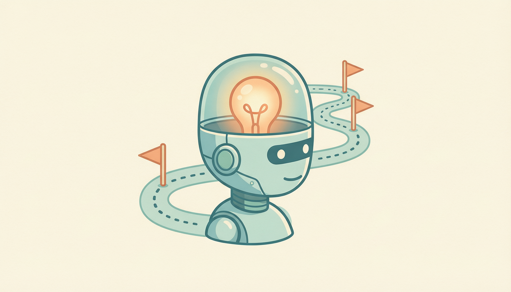
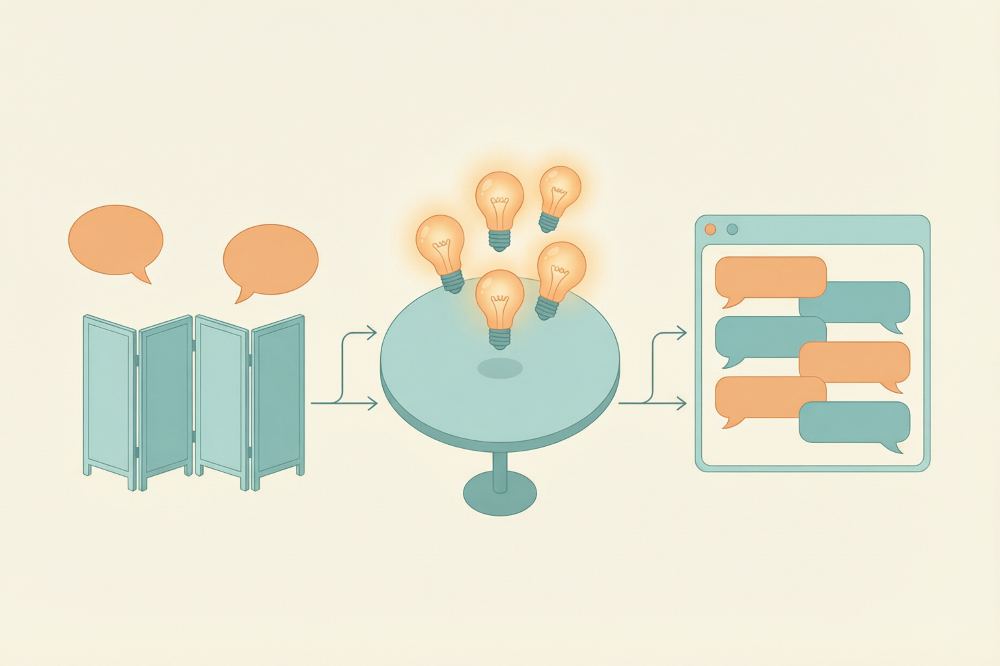

# 開場：這門課要把 AI 變成你說得清楚的東西
> 五堂課搞懂四件事：AI 是什麼、它在哪、它會出什麼錯、它怎麼「學會」做事

## 本堂你會學到

六個段落，六件帶得走的事——每一段都不一樣，不是同一句話換個說法。

- **開場與經驗盤點**：盤點自己每天已經在用的 AI，說出它們的共同點
- **AI 的定義**：說出 AI 能做與不能做的判準，並拆出智能的四種能力
- **發展歷程**：說出從圖靈測試到大模型的關鍵轉折，以及兩次寒冬的成因
- **快問快答與時間線**：把八個關鍵事件排回正確年代，並說明你的判斷依據
- **主要應用領域**：分辨三類主要應用，各舉一個生活中的實例
- **收斂分享**：用自己的話講一次 AI 是什麼，並提出一個想追下去的問題

## AI 經驗盤點

今天開始，我們花五堂課把「AI」這三個字搞懂。先從一件事開始：你其實早就在用 AI 了，只是沒有人把它叫出名字。

本堂授課 180 分鐘，第三段結束（約第 100 分鐘）休息 10 分鐘，中途另安排一次 2 分鐘站立伸展；連休息在內，實際會用到約 190 分鐘。

### 人臉辨識
解鎖手機時，它在做的是「感知」。

### 語音助理
問天氣、設鬧鐘，中間經過聽寫與理解兩道關卡。

### 推薦串流
你看得越多，它猜得越準——那是「學習」。

### 地圖導航
在幾百條路線裡挑一條，那是「決策」。

[callout type="tip" title="你一定中了至少一項"]
以上四項全是日常服務，人人至少中一項——你早就在用 AI 了，只是沒有人把它叫出名字。
[/callout]

# AI 的定義：能做與不能做
> 沒有唯一標準定義，但有一個最好用的教學定義

## 一個可以拿來用的定義

「人工智能」沒有唯一標準定義，但教學上最好用的是這一句：**讓機器做出原本需要人類智能才能做的事**。它不爭辯「什麼算智能」，而是用「原本需要人才能做」當判準。

[compare label-left="現在能做" label-right="現在還做不到"]
- 認臉、聽寫、翻譯、下棋、生成文字與圖片 | 真正理解意思、有意識、舉一反三到完全陌生的情境
- 在「指定任務」上贏過人類 | 像人一樣把一個生活常識搬到任何新問題
[/compare]

[callout type="note" title="判斷口訣"]
問它「這件事它做得到嗎」之前，先問「這是哪一類的事」——同一個 AI 常常在一件事上像天才、在隔壁的事上像小孩。
[/callout]

## 「智能」拆開看是四種能力

判斷一件事算不算 AI，可以逐一檢查它沾到哪幾種能力。

### 感知
看懂圖片、聽懂語音。例：相簿自動分類人物。

### 推理
依條件推出結論。例：地圖算最快路線。

### 學習
從大量範例中抓規律。例：推薦系統越用越準。

### 決策
在選項中挑行動。例：自駕車煞車或前進。

[callout type="tip" title="拿框架試一題"]
下圍棋的程式算不算 AI？它用到感知讀盤、推理算路、學習棋譜、決策落子——四種能力都沾到，所以多數定義下算 AI。這題沒有唯一正解，重點是你能不能用四能力框架說出理由。
[/callout]

# 發展歷程：從圖靈測試到大模型
> 七十多年，中間摔了兩次大跤

## 一切的起點：機器能思考嗎

[image-text position="left" width="45"]

三站串起來看：從「能不能分辨」，到「替它取名字」，再到「第一次被它騙過」。

年份口頭帶過就好，重點是這條線的方向。
[/image-text]

### 1950 圖靈測試
圖靈不爭辯「什麼算思考」，改問：如果它回答得讓人分不出是機器，算不算？

### 1956 達特茅斯會議
「人工智能」一詞正式誕生，一群學者樂觀宣示：一個夏天就能有重大突破。

### 1966 ELIZA
最早的聊天程式，只會照模式回應，卻讓許多人以為它「真的懂」。

[callout type="warning" title="ELIZA 效應"]
人類會把「聽起來像懂」當成「真的懂」。這個錯覺到今天的聊天 AI 仍然存在。
[/callout]

## AI 不是直線進步：兩次寒冬

### 第一次寒冬（約 1974–1980）
承諾太多、做不到，研究經費被砍。轉折點是 1973 年的 Lighthill 報告——英國一份官方評估報告認定 AI 沒有兌現承諾，英國幾乎全面撤掉研究經費。

### 第二次寒冬（約 1987–1993）
專家系統盛極而衰，「AI」一度變成不敢用的招牌。所謂專家系統，是把專家的經驗寫成一條條「如果…就…」的規則交給電腦執行；規則要人一條一條寫，遇到沒人寫過的情況就當機。

### 復興
算力與資料到位：1997 深藍擊敗西洋棋王、2012 深度學習在影像辨識大賽一戰成名、2016 AlphaGo 擊敗圍棋世界冠軍。深度學習是讓機器自己從大量例子中找出特徵，不必人先把規則定好——這正好和上一段的專家系統相反，也是整條發展史的主軸。

[callout type="note" title="這才是主軸"]
「期待→經費→失望→砍經費」的循環，比任何一個年份都值得記住。
[/callout]

## 2022 之後：大模型讓 AI 變成每個人的工具

2022 年底聊天式大模型爆紅，AI 從實驗室走進每個人的瀏覽器：不用寫程式、打字就能用。

一句話記住本章：**AI 走了七十多年，中間摔了兩次大跤，靠「資料＋算力」爬起來，才走到今天。**

# 主要應用領域概覽
> 一張地圖先看清楚，下一堂逐一打開

### 自然語言處理（NLP）
讓機器讀懂、寫出人類的語言。生活實例：翻譯、摘要、聊天客服。

### 機器視覺
讓機器「看懂」圖片與影像。生活實例：人臉解鎖、瑕疵檢測。

### 專家系統與決策類 AI
把專家規則或經驗做成可執行的判斷。生活實例：信貸審核、醫療輔助分診。

[summary]
- **AI 的定義** | 讓機器做原本需要人類智能的事；同一個 AI 常在不同任務表現天差地別
- **智能四能力** | 感知、推理、學習、決策——判斷一件事算不算 AI 的框架
- **發展歷程** | 1950 圖靈測試、1956 達特茅斯、兩次寒冬、1997 深藍、2012 深度學習、2016 AlphaGo、2022 大模型
- **不是直線** | 期待過高→寒冬→資料與算力到位→復興，這個循環是理解 AI 史的主軸
- **三大應用領域** | 自然語言處理、機器視覺、專家系統與決策類 AI
[/summary]
