# 裝備篇：認識你的團隊
> 在開始創作之前，先了解你的隊友與最強的工具 -- AI 創意夥伴

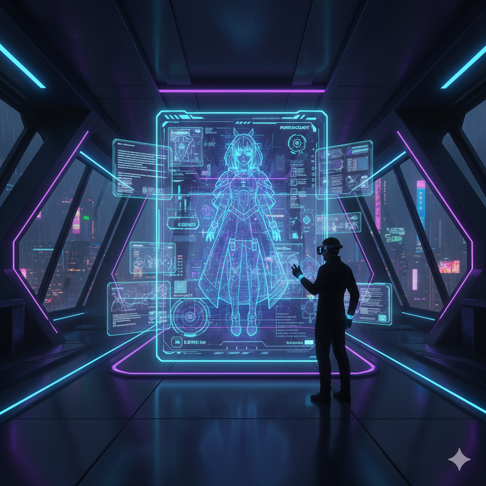

## 團隊角色分工

在每一個頂尖的設計工作室裡，都有明確的團隊分工。今天的課程中，親子將組成一個雙人設計工作室，各自扮演關鍵角色：

[compare label-left="創意總監 (Creative Director)" label-right="技術總監 (Technical Director)"]
- 負責腦力風暴，發想最酷的故事與最帥的角色 | 負責魔法詠唱，將創意轉化為 AI 能懂的工程指令
- 決定角色的名字、背景故事、超能力與個性 | 將天馬行空的想法精準地寫成 Prompt 指令
- 由孩子擔任，發揮無限想像力 | 由家長擔任，確保指令清晰可執行
- 核心能力：想像力、創造力、說故事 | 核心能力：邏輯思考、文字表達、精準溝通
[/compare]

[callout type="tip" title="合作秘訣"]
創意總監和技術總監請先握手，確認你們的超級夥伴關係正式成立。接下來所有的挑戰，都需要兩個人一起討論、一起解決。
[/callout]

## AI -- 不只是工具，更是創意夥伴

從遊戲、電影到漫畫，AI 正在改變整個創意產業。它能將你的「文字」轉化為「視覺」，學習駕馭它，就像學會一門新的超能力。

[image-text position="left" width="45"]
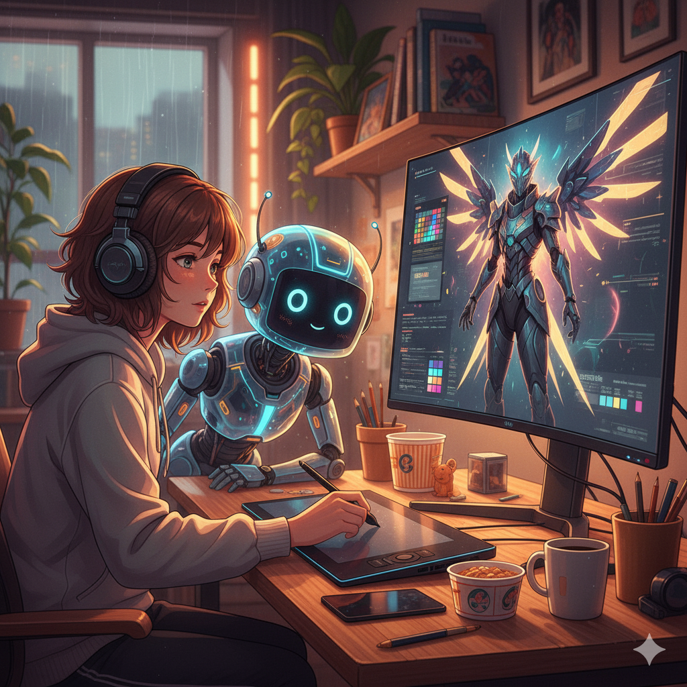
AI 就像一個懂畫畫、懂設計的超級大腦。你負責出點子、下指令，它負責快速實現你的想法。

今天你們要體驗的，就是如何跟這位聰明的夥伴合作，把腦中的酷炫角色變成真實的圖像。
[/image-text]

## AI 的驚人創作力

別小看 AI 的能力。從細節滿滿的遊戲角色，到充滿想像力的奇幻世界，甚至是張力十足的漫畫場景 -- 這些都是 AI 根據人類的指令生成的。你的指令越精準、越有創意，AI 回饋的成果就越驚人。

### 案例一：賽博龐克風格遊戲角色

[image-text position="right" width="40"]
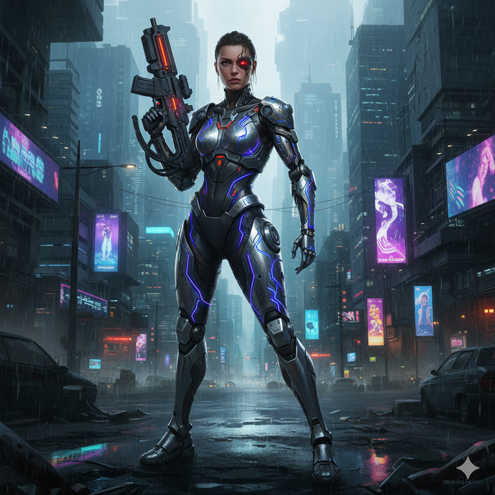
要畫出這樣的角色，我們至少要告訴 AI 三類關鍵字：

- **核心主體 (Subject)**：女生、戰士、半機器人
- **細節特徵 (Details)**：盔甲、霓虹燈、拿著槍、未來感
- **藝術風格 (Style)**：遊戲、寫實、賽博龐克
[/image-text]

### 案例二：吉卜力動畫風格奇幻場景

[image-text position="left" width="40"]
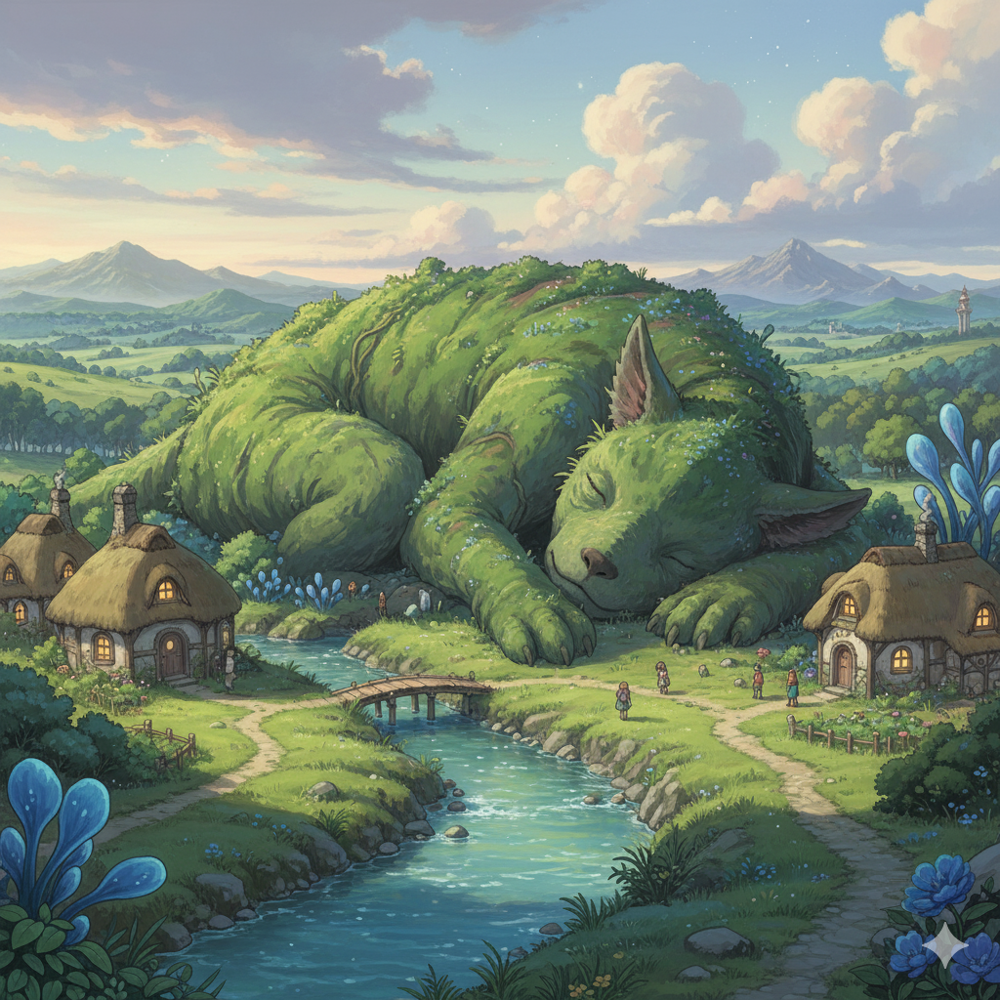
要畫出這個有龍貓感覺的畫面，關鍵字包括：

- **核心主體 (Subject)**：巨大的生物、睡覺、村莊、河流
- **細節特徵 (Details)**：森林、長滿青苔、和平的、天空很藍
- **藝術風格 (Style)**：宮崎駿、吉卜力、動畫電影、手繪感
[/image-text]

### 案例三：美式漫畫風格超級英雄

[image-text position="right" width="40"]
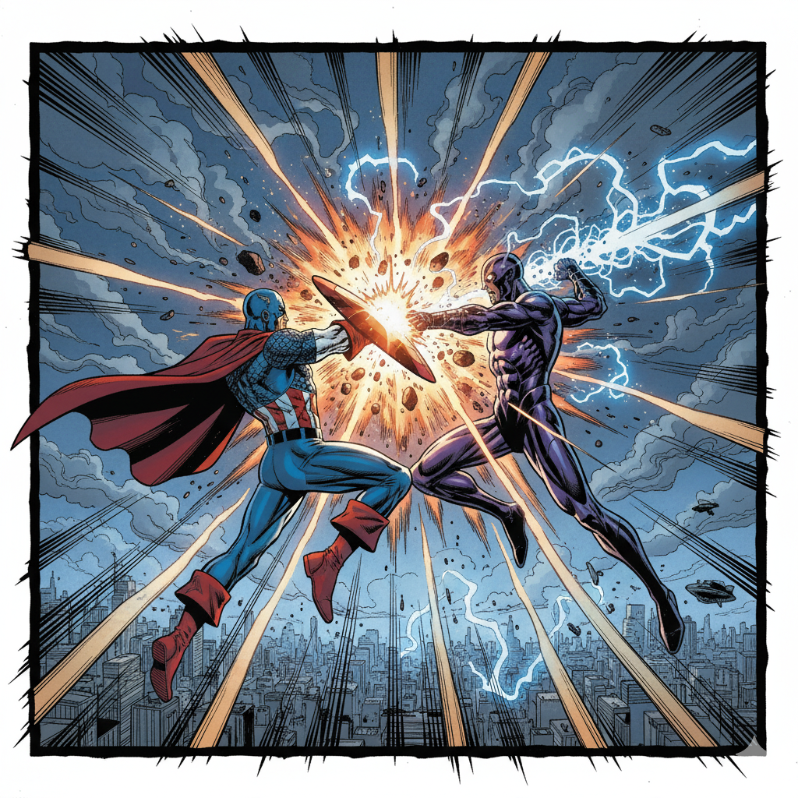
要畫出像漫威電影一樣的打鬥畫面，關鍵字包括：

- **核心主體 (Subject)**：兩個超級英雄、對撞、飛在空中
- **細節特徵 (Details)**：爆炸、能量光束、很有動作感、肌肉
- **藝術風格 (Style)**：漫畫、美式風格、漫威
[/image-text]

[quiz type="single"]
Q: 觀察上面三個案例，以下哪一個「不是」建構好 Prompt 的三大核心要素之一？
- [ ] 核心主體 (Subject) -- 告訴 AI 你要畫什麼
- [ ] 細節特徵 (Details) -- 描述外觀和動作細節
- [x] 畫面的解析度 (Resolution) -- 設定圖片的像素大小
- [ ] 藝術風格 (Style) -- 指定想要的視覺風格
Hint: 三大核心要素是主體、特徵、風格，解析度不是關鍵要素。
[/quiz]

[summary]
- **團隊分工** | 創意總監負責發想，技術總監負責下指令，親子合作發揮最大戰力
- **AI 是夥伴** | AI 不只聽命令，它能理解你的創意並快速實現
- **三大關鍵字** | 主體、細節、風格 -- 是解鎖 AI 創作力的密碼
[/summary]

---

# 咒語篇：掌握指令的藝術
> 學會 Prompt 工程的四要素公式，讓你的指令從普通升級為傳說級

## 四要素 Prompt 公式

專業人士把「下指令」這件事稱為 Prompt Engineering -- 指令工程學。其實它有公式可循，一個好的 Prompt 至少包含四個部分：

[image-text position="left" width="40"]
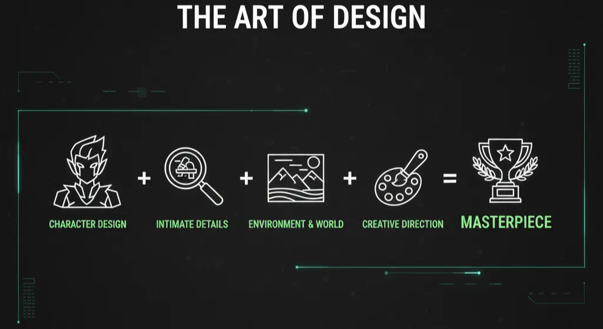
把四個要素像拼圖一樣組合在一起，就能產出令人驚豔的結果。缺少任何一個要素，AI 的創作就會變得模糊、缺乏方向。
[/image-text]

[flow]
1. 核心主體 (Subject) -- 你的主角是誰？例如：一位年輕的魔法師
2. 細節特徵 (Details) -- 他有什麼特徵？例如：戴著星星圖案的帽子，藍色眼睛
3. 環境背景 (Background) -- 他在哪裡？例如：站在古老的圖書館裡
4. 藝術風格 (Style) -- 你想要什麼風格？例如：日本動漫風格
[/flow]

把這四個元素組合起來，就像在調配一瓶魔法藥水。範例如下：

```prompt [label="完整 Prompt 範例"]
一位年輕的魔法師，戴著星星圖案的帽子，藍色眼睛，站在古老的圖書館裡，日本動漫風格
```

## 咒語升級挑戰 -- 從 LV.1 到 LV.99

建構指令就像是遊戲裡的角色升級。每一層新增的元素，都讓你的指令更強大：

[image-text position="right" width="45"]
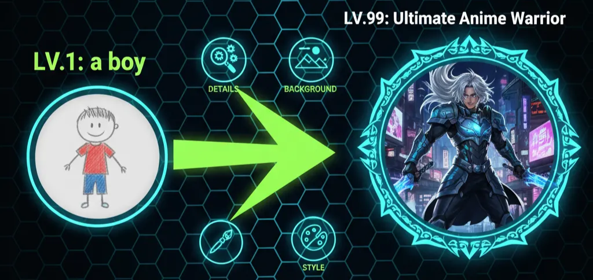
- **LV.1 咒語**："一個男孩" -- 很普通
- **+ 細節特徵** -- 角色升級
- **+ 環境背景** -- 戰鬥力 UP
- **+ 藝術風格** -- 史詩級進化
- **= LV.99 傳說級咒語**
[/image-text]

### 升級前後對比

[compare label-left="LV.1 普通咒語" label-right="LV.99 傳說級咒語"]
- Prompt: "a boy" | Prompt: "a boy with silver hair, glowing blue eyes, wearing futuristic armor with neon patterns"
- 結果：很普通、沒有特色 | 結果：高度細節、動態感十足的角色設計
- 缺乏個性和故事感 | 充滿故事背景和視覺張力
[/compare]

[quiz type="single"]
Q: 以下哪一個 Prompt 版本最接近 LV.99 傳說級咒語？
- [ ] "一個機器人"
- [ ] "一個機器人，金色外殼"
- [ ] "一個機器人，金色外殼，站在城市裡"
- [x] "一個戰鬥機器人，金色外殼配紅色眼睛，站在廢棄的賽博龐克城市廢墟中，概念藝術風格"
Hint: LV.99 的咒語要同時包含主體、細節、背景和風格四個要素。
[/quiz]

## 風格庫 -- 為你的角色換上 SKIN

風格決定了你角色的靈魂。同樣的角色，用不同的風格指令，會產生完全不同的感覺。以下是六大超好用的風格關鍵字，把它們當作你的技能卡：

[tags]
- [blue] Anime -- 動漫風：熱血、大眼睛、鮮豔色彩
- [purple] Cyberpunk -- 賽博龐克：霓虹燈、高科技、暗色調
- [orange] Concept Art -- 遊戲概念藝術：精細、寫實、專業設定感
- [green] Watercolor -- 水彩風：柔和、渲染、藝術氣質
- [purple] Comic Book -- 美式漫畫：粗線條、高對比、動態張力
- [blue] Studio Ghibli -- 吉卜力風格：溫暖、奇幻、手繪質感
[/tags]

[image-text position="left" width="45"]
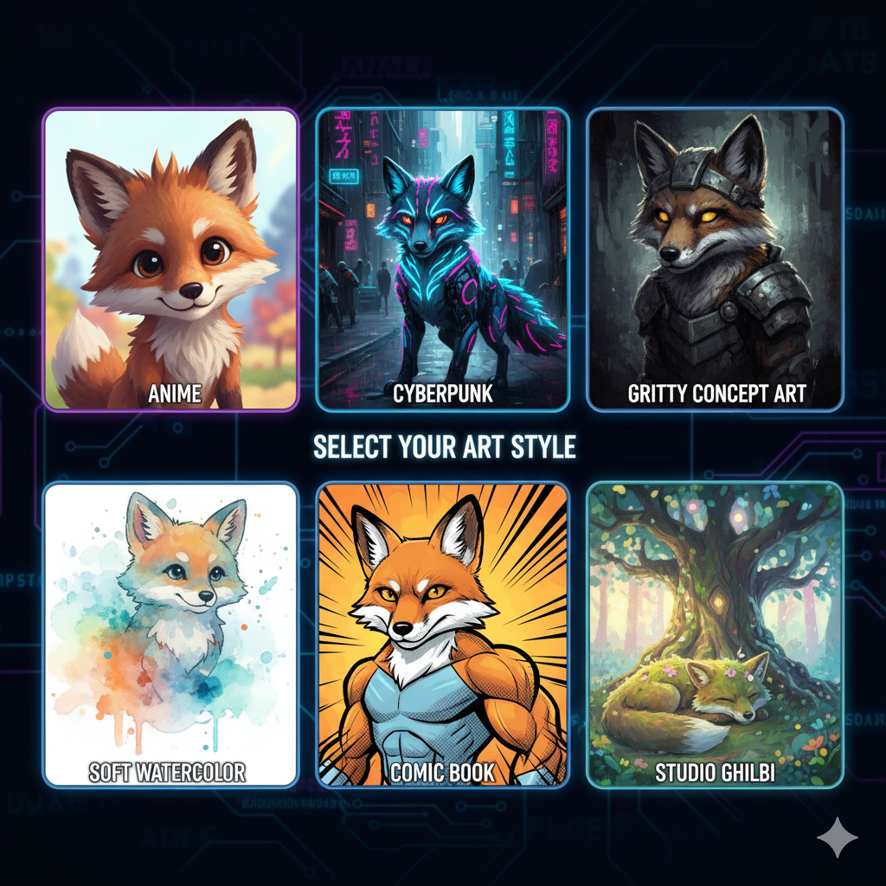
每一張風格卡都像一把能改變世界樣貌的武器。在你的咒語最後加上一張你最喜歡的風格卡，看看會發生什麼神奇的化學反應。

創意總監和技術總監請先討論，為你們等一下的專案挑選一到兩種最適合的風格裝備。
[/image-text]

## 實用工具 -- Leonardo.ai

Leonardo.ai 是今天我們要使用的 AI 繪圖平台。它有一個非常方便的功能：你可以先輸入中文描述，然後使用 Improve Prompt 功能，讓系統自動幫你轉換成專業的英文 Prompt。

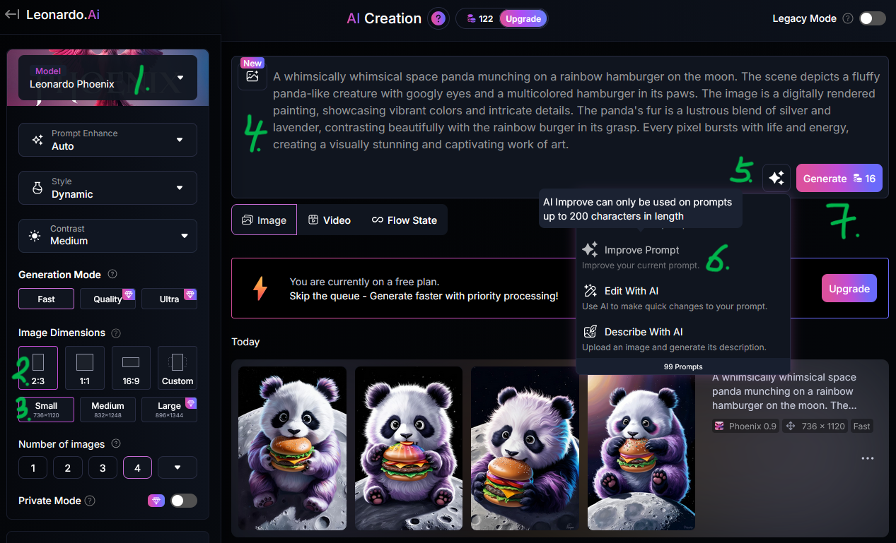

[callout type="info" title="操作小技巧"]
不需要擔心英文不夠好。先用中文把你想像的畫面完整描述出來，再按 Improve Prompt 按鈕，系統就會幫你轉成 AI 最容易理解的英文指令。
[/callout]

[bonus title="延伸閱讀：Prompt 進階技巧"]
- 使用 negative prompt 排除你不想要的元素，例如 "no text, no watermark"
- 加入 "highly detailed" 或 "4K" 可以提升畫面精細度
- 嘗試組合多種風格，例如 "anime style with cyberpunk elements"
- 用 "cinematic lighting" 或 "dramatic angle" 增加畫面的戲劇感
[/bonus]

[summary]
- **四要素公式** | 主體 + 細節 + 背景 + 風格 = 傳說級 Prompt
- **咒語升級思維** | 從 LV.1 到 LV.99，每加一個要素都讓結果更強
- **六大風格裝備** | Anime、Cyberpunk、Concept Art、Watercolor、Comic Book、Ghibli
- **Leonardo.ai** | 中文輸入 + Improve Prompt 自動轉英文，零門檻上手
[/summary]

---

# 實戰篇：接受委託，創造角色
> 暖身練習、接受緊急委託、設計你的原創角色，並學會迭代優化的核心技能

## 一分鐘暖身挑戰

在接受正式任務之前，先來一個快速暖身。請所有工作室立刻嘗試詠唱以下咒語：

[callout type="tip" title="暖身咒語"]
一隻在月球上吃著彩虹漢堡的太空貓熊
[/callout]

[image-text position="right" width="40"]
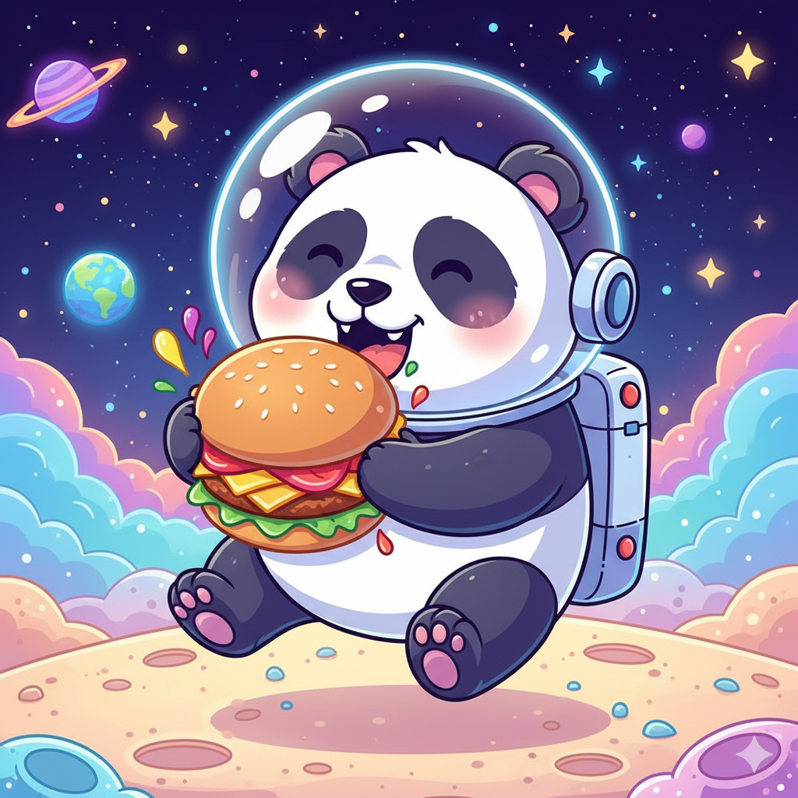
試著把這個中文描述輸入 Leonardo.ai，按下 Improve Prompt，然後生成看看。觀察 AI 如何理解你的指令，以及結果跟你想像的是否一致。

這個暖身能幫助你快速熟悉操作流程，為接下來的主線任務做好準備。
[/image-text]

## 緊急委託 -- 星塵遠征

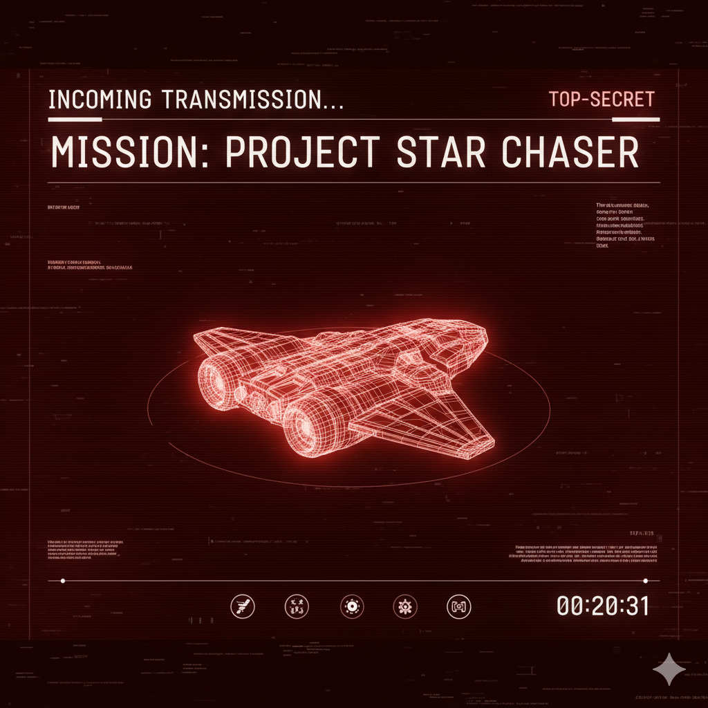

正式任務來了。知名遊戲公司「幻想引擎 (Fantasy Engine)」正在開發一款名為《星塵遠征》的新遊戲，但他們的主角設計遇到了瓶頸。

### 委託內容

- **委託方**：遊戲公司「幻想引擎 (Fantasy Engine)」
- **專案名稱**：《星塵遠征》
- **任務簡報**：設計一位「既勇敢又帶點神秘感」的星際探險家
- **設計自由度**：種族、裝備、技能全權交由你們設計
- **截止時間**：現在

## 你的創作任務

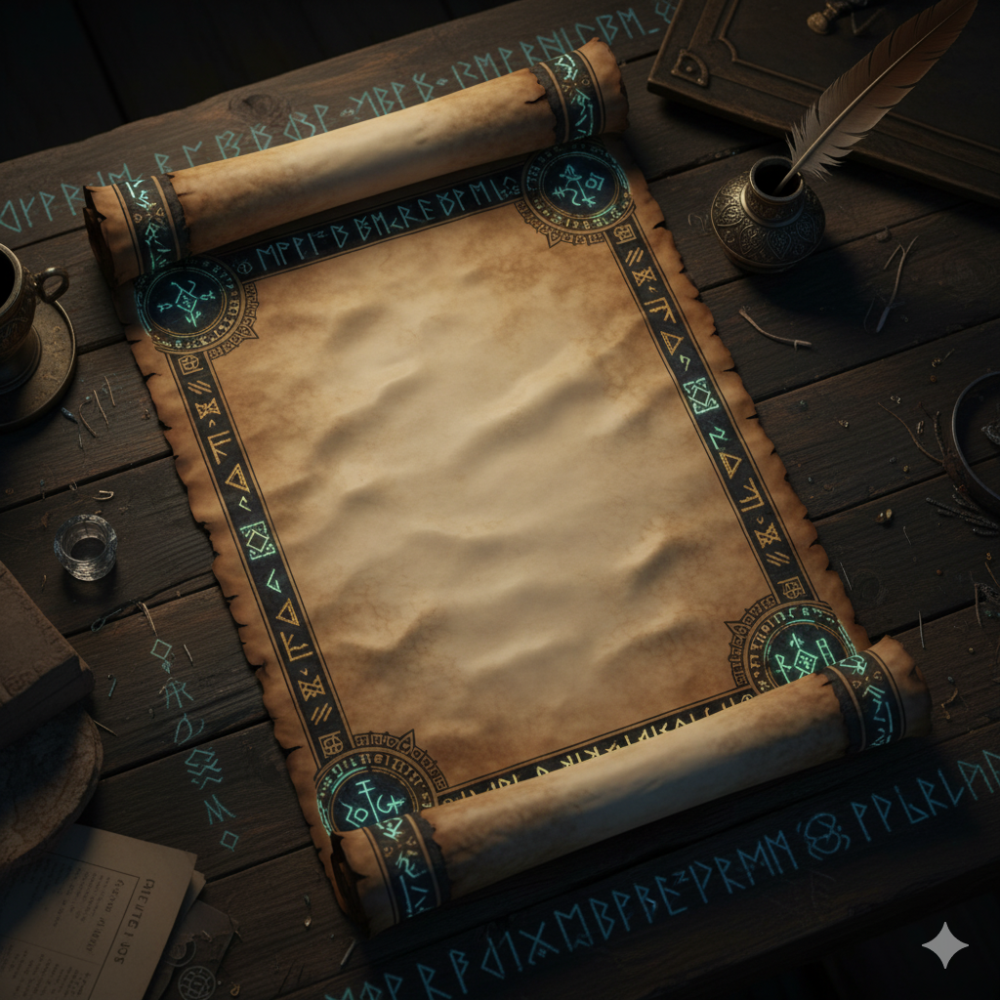

在下指令之前，先花點時間和夥伴討論以下問題。這些思考會幫助你的 Prompt 更有深度，讓 AI 創造出來的角色不只好看，更有靈魂：

### 角色設計思考清單

- **名字與背景**：你的角色叫什麼名字？來自哪個星球或文明？
- **超能力或技能**：他有什麼獨特的能力？是戰鬥型、智慧型還是探索型？
- **個性特質**：他是開朗外向還是沉穩內斂？勇敢中帶有神秘感要如何表現？
- **視覺元素**：什麼樣的裝備、服裝、配色能傳達他的個性？

[callout type="warning" title="重要提醒"]
不要急著下指令。先討論、先思考，建構出最精準的 Prompt 之後再開始生成。好的設計來自好的規劃。
[/callout]

## Debug 時間 -- 迭代優化

在設計界，沒有一次就成功的。我們把「不斷修改、越改越好」的過程叫做「迭代」。AI 有時候會聽錯指令，畫出一些搞笑的東西，但這正是 Debug 的機會。

[image-text position="left" width="45"]
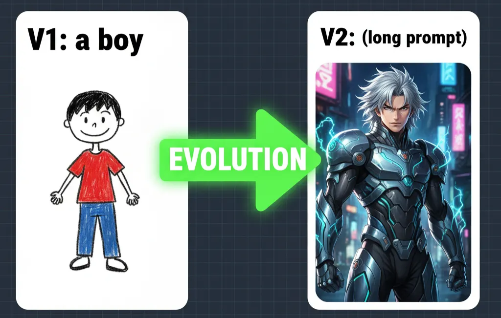
**V1.0 (有 Bug)**：Prompt 只有 "a boy"，結果很普通。

**V2.0 (Bug 修復)**：加入 silver hair, glowing eyes, armor 等細節，角色立刻有了生命。

每一次的修改都是一次版本更新。有時候 AI 意外跑出來的「Bug」，反而會給你更有趣的靈感。
[/image-text]

### 迭代優化的三個方向

- **細節不夠？** 檢查是否缺少服裝、配件、表情、姿勢等描述
- **風格不對？** 確認藝術風格關鍵字是否明確，例如改用 Concept Art 或 Anime
- **背景太单调？** 加入場景描述，例如「站在星際太空站的觀景台，窗外是銀河」

[quiz type="bool"]
Q: AI 生成了一張你不滿意的結果時，最好的做法是直接放棄，重新寫一個完全不同的 Prompt。
- [ ] 是
- [x] 否
Hint: 最好的做法是在現有 Prompt 基礎上進行 Debug 迭代，逐步修正細節，而不是全部重來。
[/quiz]

[summary]
- **暖身練習** | 用「太空貓熊」快速熟悉 Leonardo.ai 操作流程
- **緊急委託** | 為《星塵遠征》設計一位既勇敢又神秘的星際探險家
- **角色思考** | 先想名字、背景、能力、個性，再轉化為 Prompt 指令
- **迭代優化** | V1.0 總是有 Bug，透過不斷修改讓角色越來越好
[/summary]

---

# 交付篇：展示你的傑作
> 選出最佳作品、簽署交付、裝裱典藏，並在創作者聚光燈下分享你的設計故事

## 作品交付流程

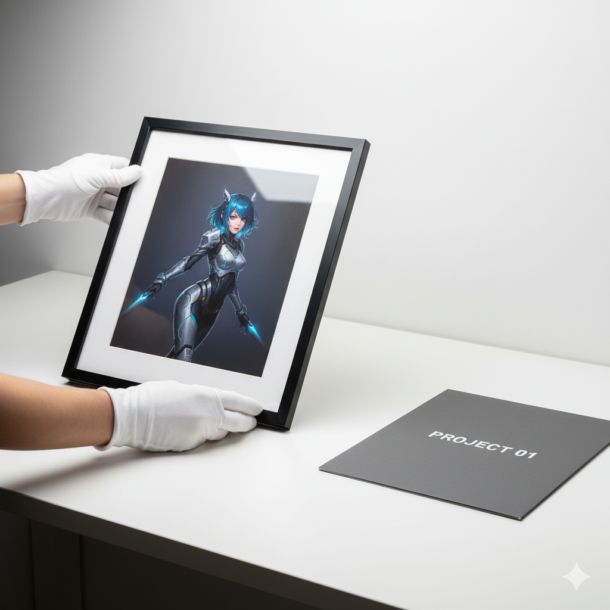

當你對角色設計感到滿意時，就該進行正式交付。這不只是交作業，而是你作為設計師的第一號正式作品。

[steps-status]
- [done] 腦力激盪 | 與夥伴討論角色設定與 Prompt
- [done] 迭代優化 | 經過多次 Debug 達到最佳版本
- [doing] 選出最佳作品 | 從所有版本中挑選你最滿意的一張
- [todo] 簽署與裝裱 | 在作品角落簽上工作室大名，裝入畫框
[/steps-status]

### 創作典藏三步驟

- **Finalize**：敲定你的最終版本，確認這就是你要的設計
- **Print**：高解析度列印，確保畫面品質
- **Archive**：裝裱入框，成為你的第一份作品集

[callout type="tip" title="簽署儀式"]
請創意總監和技術總監一起，在你們作品的角落簽上工作室的大名。這代表了你們對這件作品的認可與驕傲。從今天起，這就是你們工作室的第一號正式作品。
[/callout]

## 創作者聚光燈

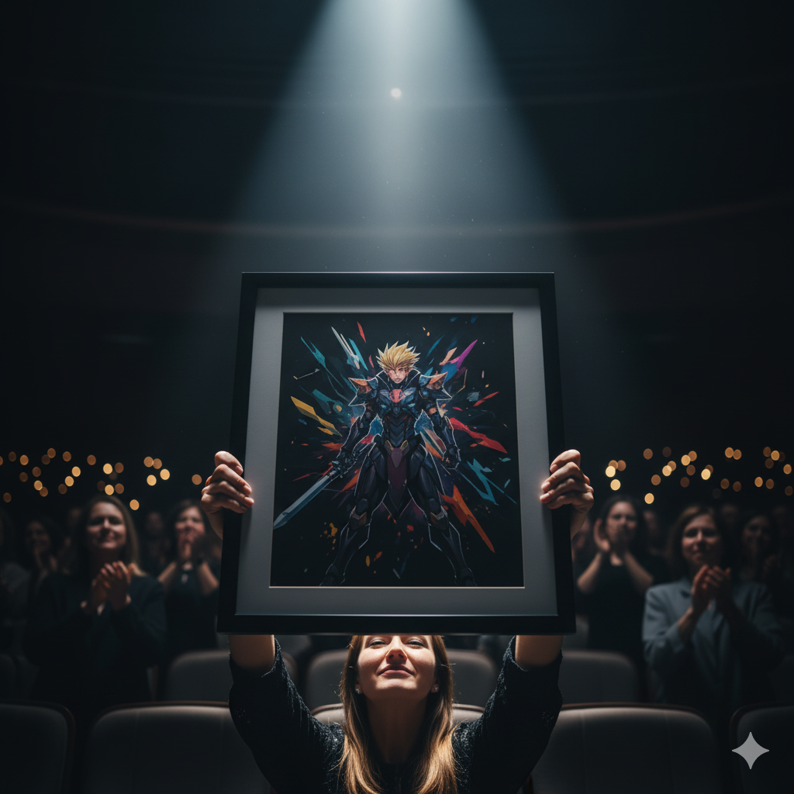

現在，實驗室的燈光將聚焦在今天的創作者身上。分享時不只要展示角色有多酷，更要說出背後的故事：

### 分享三大重點

- **世界觀**：你的角色來自什麼樣的世界？有什麼樣的背景故事？
- **Prompt 優化過程**：你在創作中如何一步步優化你的 Prompt？遇到了什麼困難？
- **團隊合作**：你和夥伴是如何分工的？創意總監和技術總監各貢獻了什麼？

## 設計師畫廊

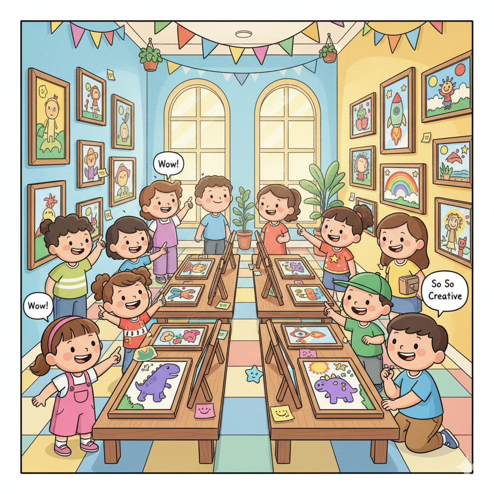

### 畫廊漫步三步驟

- **展出簽名大作**：把裝裱好的作品展示在你的位置上
- **貼上角色人設**：用便利貼寫下一句話介紹你的角色（角色台詞或人物設定），貼在畫框旁
- **自由逛展**：走動欣賞其他工作室的成果，如果對某個角色特別好奇，直接詢問該工作室的設計師

[vote id="best-design" title="逛完畫廊後，你最欣賞哪一組的設計作品？"]
- 第一組
- 第二組
- 第三組
- 第四組
- 第五組
- 第六組
[/vote]

## 任務完成 -- 能力認證

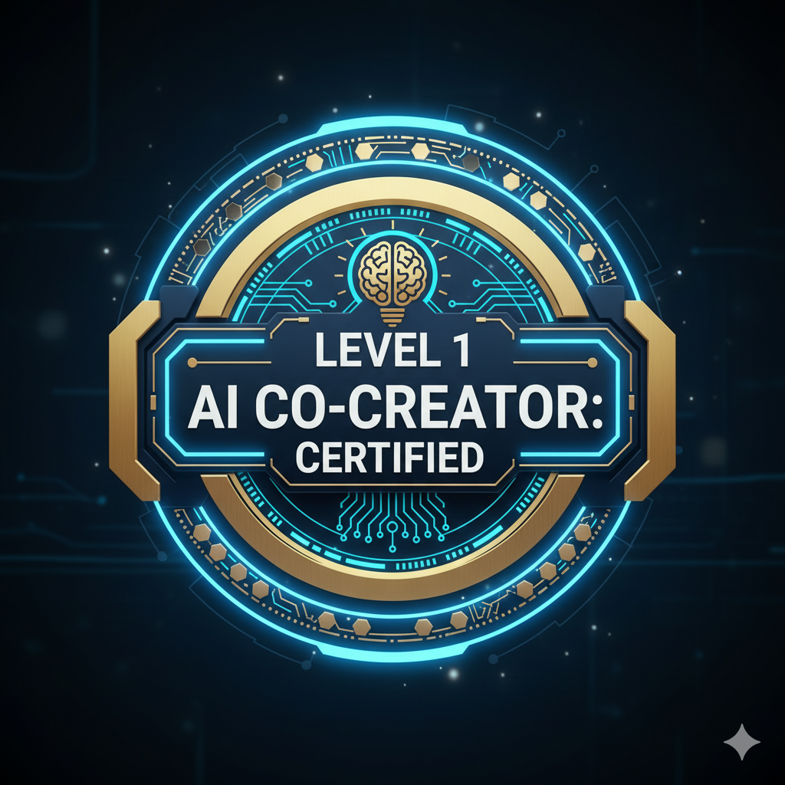

各位頂尖設計師，今天你們不僅完成了一項艱鉅的委託，更證明了絕佳的創意與團隊合作能力。AI 是強大的工具，但真正賦予作品靈魂的，是創意總監的奇思妙想，以及技術總監的精準執行。是你們的合作，解鎖了創造力的無限可能。

所有工作室，全員通過「AI 協同創作者」一級認證。

## 你的冒險才剛開始

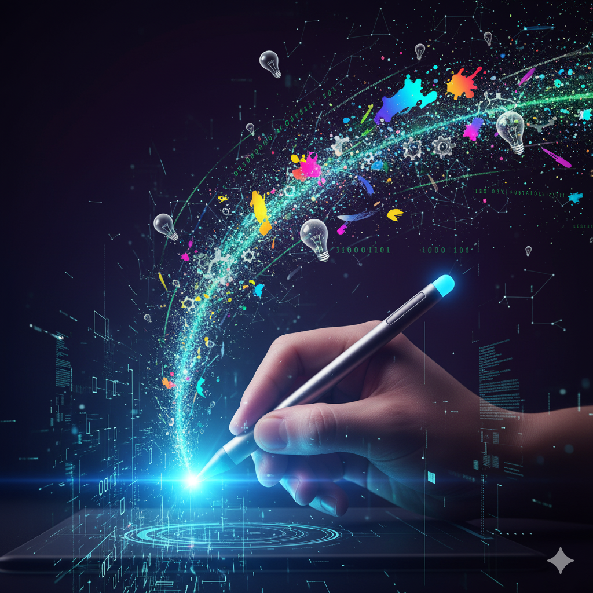

今天的實驗室時間即將結束，但這不是終點，而是起點。你們今天解鎖的不只是一個 AI 工具，而是將自己的想像力具現化的能力。

> **AI 只是畫筆，真正的藝術家是手握畫筆的你**
> 記住今天學到的 Prompt 四要素公式、迭代優化的精神、以及團隊合作的力量。回家後繼續探索、繼續提問、繼續創造。

[bonus title="回家挑戰：進階創作任務"]
- 用今天學到的 Prompt 公式，為你的角色設計一個「宿敵」或「搭檔」
- 嘗試用不同的藝術風格重新生成同一個角色，比較差異
- 把你的角色故事寫成一段 100 字的短文，下次帶來分享
- 挑戰生成一整組「角色設定集」：包含正面、側面、背面三個角度
[/bonus]

[summary]
- **正式交付** | 選出最佳版本、簽署裝裱，完成第一號作品集
- **聚光燈分享** | 說出角色的世界觀、Prompt 優化過程與團隊分工故事
- **畫廊漫步** | 展出作品、寫下人設、互相欣賞與交流
- **冒險延續** | AI 是畫筆，你是藝術家 -- 繼續探索、繼續創造
[/summary]
