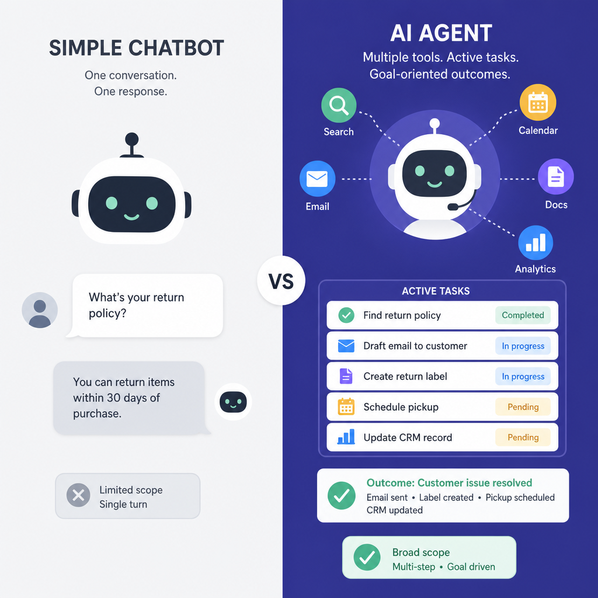
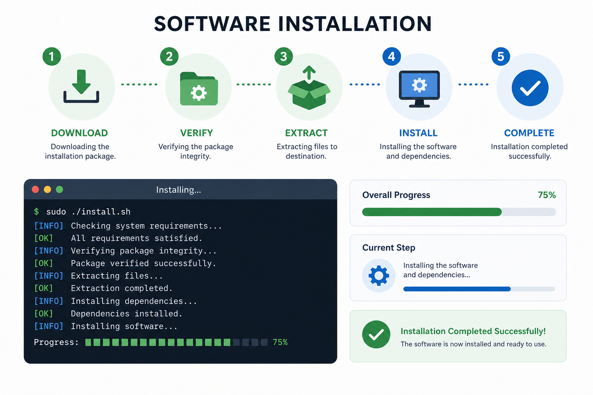
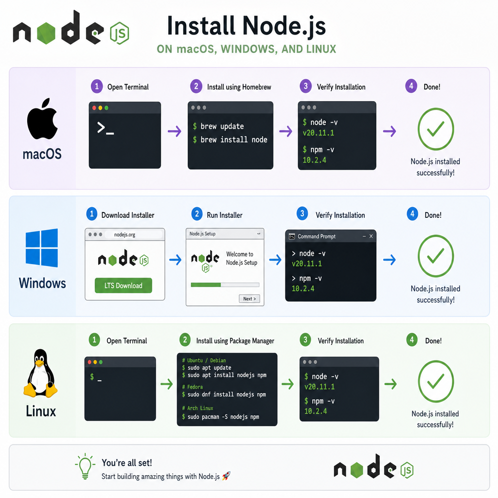
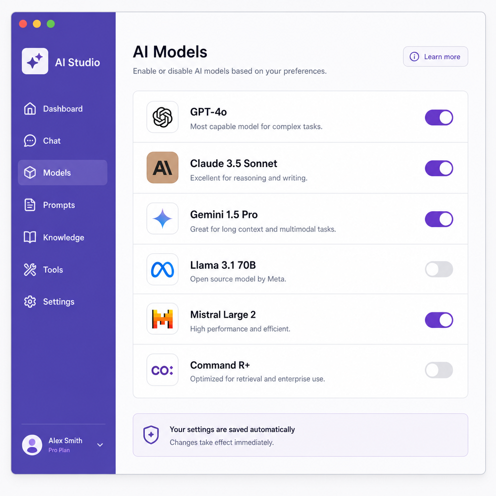
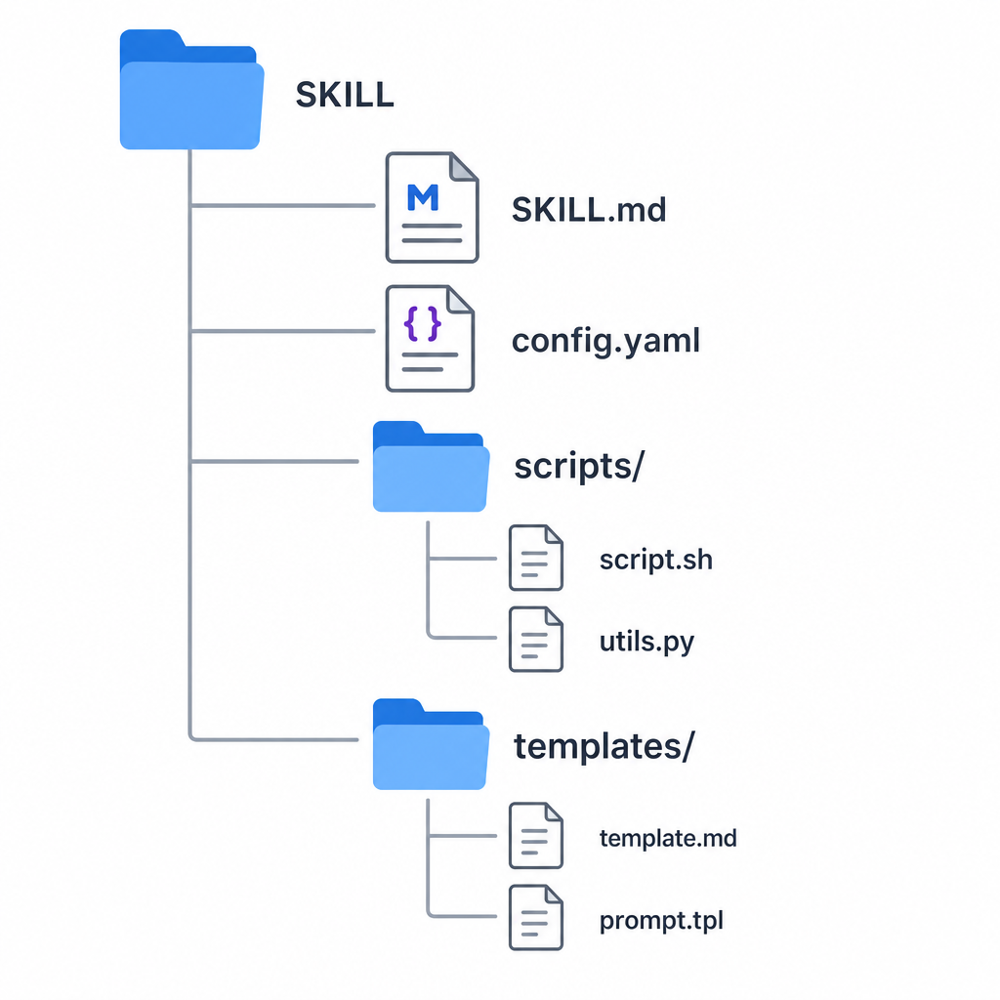
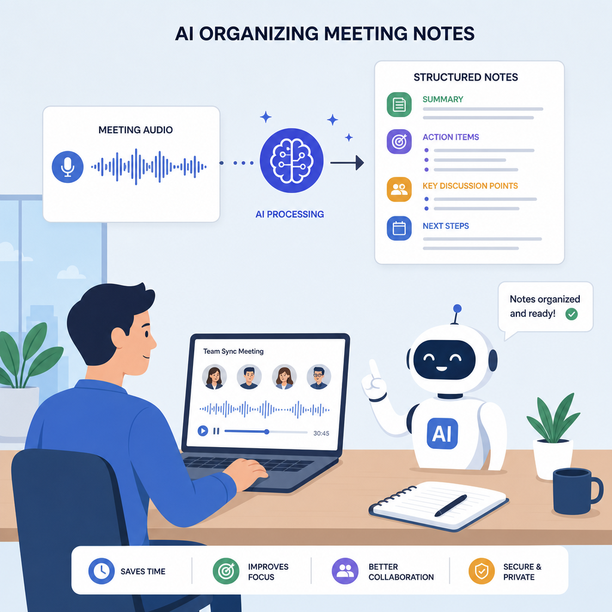

# 認識 OpenCode：什麼是 OpenCode？


> OpenCode 是一款開源的 AI 編程助手，讓你用自然語言與程式碼互動。

## 為什麼需要 OpenCode？

### 傳統開發的痛點
- 重複性任務耗費大量時間
- 除錯與查找文件耗費心力
- 新技術學習曲線陡峭
- 跨語言協作門檻高

### OpenCode 能幫你做什麼？
- 用自然語言描述需求，AI 生成程式碼
- 自動除錯並提供修復建議
- 快速理解陌生程式碼庫
- 生成文件、測試與重構建議

> **OpenCode 的核心價值**
> 它不是取代開發者，而是讓開發者專注在創造性工作，把重複性任務交給 AI。

## AI Agent vs AI Bot：有什麼分別？



### 先搞懂：AI Bot 是什麼？
- **單輪對話** — 你問一句，它答一句，對話結束就忘了
- **被動回應** — 只能回答問題，無法主動執行任務
- **無法操作外部工具** — 不能讀取檔案、呼叫 API、執行程式
- **典型代表** — ChatGPT 網頁版、客服聊天機器人

### 再來看：AI Agent 是什麼？
- **多輪對話** — 記住上下文，持續追蹤任務進度
- **主動執行** — 不只回答，還能動手做（讀檔、寫檔、執行指令）
- **可操作外部工具** — 整合 Git、資料庫、瀏覽器、檔案系統
- **典型代表** — OpenCode、Claude Code、Cursor

[compare label-left="AI Bot" label-right="AI Agent"]
- 單輪對話，問完就忘 | 多輪對話，記住上下文
- 被動回答問題 | 主動執行任務
- 只能生成文字 | 能讀寫檔案、執行指令
- 無法操作外部工具 | 整合 Git、API、資料庫
- 適合簡單查詢 | 適合複雜工作流
[/compare]

> **為什麼要用 AI Agent？**
> AI Bot 像是一個「問答機器」，你問它答；AI Agent 像是一個「工作夥伴」，你說目標，它動手完成。OpenCode 屬於後者，讓 AI 真正成為你的助手，而不只是聊天對象。

## OpenCode 的特色

### 開源且可自訂
- 完全開源，社群驅動
- 支援多種 AI 模型（Claude、GPT、Gemini 等）
- 可本地部署，保護程式碼隱私

### 終端機原生體驗
- 在命令列中直接操作
- 與 Git、編輯器無縫整合
- 低資源消耗，啟動快速

---

# 安裝與初始設定：從零開始



> 三分鐘完成安裝，開啟你的 AI 助手之旅。

## 系統需求與 Node.js 安裝



### 環境需求
- Node.js 18+ 或更高版本
- 支援 macOS、Linux、Windows
- 穩定的網路連線（用於 API 呼叫）

### macOS 安裝 Node.js
```terminal [label="使用 Homebrew（推薦）"]
brew install node@22
```

```terminal [label="驗證安裝"]
node --version
npm --version
```

### Windows 安裝 Node.js
- 前往 https://nodejs.org 下載 LTS 版本
- 執行安裝檔，勾選「Automatically install necessary tools」
- 安裝完成後，開啟 PowerShell 驗證

```terminal [label="Windows PowerShell"]
node --version
npm --version
```

### Linux 安裝 Node.js
```terminal [label="Ubuntu / Debian"]
curl -fsSL https://deb.nodesource.com/setup_22.x | sudo -E bash -
sudo apt-get install -y nodejs
```

```terminal [label="驗證安裝"]
node --version
npm --version
```

### 常見問題排除
- **權限錯誤** — macOS/Linux 使用 `sudo npm install -g`，或設定 npm 全域路徑
- **版本過舊** — 使用 `nvm`（Node Version Manager）管理多版本
- **網路問題** — 設定 npm mirror 或使用代理

## 安裝 OpenCode

### 安裝步驟
```prompt [label="全域安裝 OpenCode"]
npm install -g opencode
```

```prompt [label="驗證安裝"]
opencode --version
```

## 首次啟動設定

### 初始化專案
```prompt [label="進入專案目錄"]
cd your-project
opencode init
```

### 設定檔結構
- `opencode.json` — 專案層級設定
- `~/.opencode/config.json` — 全域設定
- 支援 `.env` 檔管理 API Key

> **小提醒**
> 首次啟動時，OpenCode 會引導你完成基本設定，包括選擇 AI 供應商與模型。

---

# 供應商設定：串接你的 AI 模型


> OpenCode 支援多種 AI 供應商，讓你選擇最適合的模型。

## 支援的 AI 供應商

### 主流供應商
- **Anthropic** — Claude 系列（Claude 3.5 Sonnet、Claude 3 Opus）
- **OpenAI** — GPT 系列（GPT-4o、GPT-4 Turbo）
- **Google** — Gemini 系列（Gemini 1.5 Pro、Gemini Ultra）
- **本地模型** — Ollama、LM Studio

### 更多 API 供應商
- 完整供應商比較（價格、特點、適用場景）請參考：[API 供應商清單](https://docs.google.com/spreadsheets/d/1U6g5HTJH8qWt0wrxh1KLWlWZ7VQ1fQ2VL1MMgk_DUQM/edit?usp=sharing)
- 包含國內外主流 AI API 供應商，可根據需求與預算選擇

### 如何選擇模型？
- **程式碼生成** — Claude 3.5 Sonnet、GPT-4o
- **長文本理解** — Claude 3 Opus、Gemini 1.5 Pro
- **快速回應** — GPT-4 Turbo、Claude 3 Haiku
- **離線使用** — Ollama + Llama 3

## 設定 API Key

### 環境變數設定
```terminal [label="macOS / Linux"]
export ANTHROPIC_API_KEY="your-key-here"
export OPENAI_API_KEY="your-key-here"
```

```terminal [label="Windows PowerShell"]
$env:ANTHROPIC_API_KEY="your-key-here"
$env:OPENAI_API_KEY="your-key-here"
```

### 專案設定檔
```prompt [label="opencode.json"]
{
  "provider": "anthropic",
  "model": "claude-3-5-sonnet-20241022",
  "temperature": 0.7
}
```

## 實作：連接 DMXAPI

### 課程提供的 API 連接
- **API 端點**：`https://www.dmxapi.cn/v1`
- **API Key**：`sk-40D6ANNlXXo03rZ6hVVwlmf5eqrnvcPqZTtdIiFhd0Vg4eY4`

### 設定方式
```prompt [label="opencode.json"]
{
  "provider": "openai",
  "baseUrl": "https://www.dmxapi.cn/v1",
  "apiKey": "sk-40D6ANNlXXo03rZ6hVVwlmf5eqrnvcPqZTtdIiFhd0Vg4eY4",
  "model": "gpt-4o"
}
```

> **提醒**
> 這是教學用 API Key，可能有使用限制。實際專案中，建議到 DMXAPI 官網申請自己的 Key，並妥善保管。

> **安全建議**
> 不要將 API Key 提交到版本控制。使用 `.env` 檔並加入 `.gitignore`。

## 使用 CC Switch 簡化設定



### 什麼是 CC Switch？
CC Switch 是一個開源的 AI 編程 CLI 統一管理工具，讓你輕鬆切換和管理多種 AI 工具。

官網：[https://ccswitch.io/zh/](https://ccswitch.io/zh/)

### 支援的工具
- Claude Code
- OpenCode
- Gemini CLI
- Codex
- OpenClaw
- Hermes Agent

### 對新手友好的設計

#### 圖形化介面
- 不需要記住複雜的 CLI 指令
- 所見即所得的操作體驗
- 直覺式的配置流程

#### 一鍵切換模型
- 快速在不同 AI 模型間切換
- 不用重新設定環境變數
- 支援同時管理多個供應商

#### 統一管理
- 一個介面管理所有 AI CLI 工具
- 集中配置 API Key
- 視覺化查看使用狀態

#### 預設配置
- 開箱即用的預設設定
- 自動偵測已安裝的工具
- 新手無需從零開始配置

### 安裝與使用
前往 GitHub Releases 頁面下載適合你作業系統的安裝檔：

**下載連結**：[https://github.com/farion1231/cc-switch/releases](https://github.com/farion1231/cc-switch/releases)

- **macOS** — 下載 `.dmg` 檔案，拖曳到應用程式資料夾
- **Windows** — 下載 `.exe` 安裝檔，執行安裝精靈
- **Linux** — 下載 `.AppImage` 或 `.deb` 檔案

```terminal [label="macOS 使用 Homebrew 安裝（可選）"]
brew install --cask ccswitch
```

```terminal [label="啟動 CC Switch"]
# macOS
open -a "CC Switch"

# Windows
# 從開始選單啟動

# Linux
./cc-switch.appimage
```

> **新手推薦**
> 如果你覺得手動編輯設定檔太複雜，CC Switch 是最好的選擇。圖形化介面讓你像切換 App 一樣簡單地管理 AI 工具。

---

# 模型設計：打造專屬助理
> 透過 System Prompt 與工具設定，讓 OpenCode 成為你的專屬助理。

## System Prompt 設計

### 什麼是 System Prompt？
- 定義 AI 的角色與行為
- 設定回應風格與格式
- 限制或引導 AI 的能力範圍

### 撰寫原則
- **明確角色** — 「你是一位資深前端工程師」
- **設定邊界** — 「只回答與 React 相關的問題」
- **定義格式** — 「用條列式回答，附帶程式碼範例」

## 實用範本

### 前端開發助理
```prompt [label="system-prompt.md"]
你是一位精通 React、TypeScript 的前端工程師。
回答時請：
1. 優先使用函式元件與 Hooks
2. 提供完整的程式碼範例
3. 說明潛在的效能問題
```

### 程式碼審查助理
```prompt [label="system-prompt.md"]
你是一位嚴謹的程式碼審查專家。
審查時請關注：
- 安全性漏洞
- 效能瓶頸
- 可維護性
- 測試覆蓋率
```

## 工具整合

### 自訂工具
- 定義工具名稱與描述
- 設定輸入參數與輸出格式
- 讓 AI 能呼叫外部 API 或腳本

### 常見整合場景
- 查詢資料庫
- 呼叫內部 API
- 執行自動化腳本
- 讀取外部文件

> **進階技巧**
> 結合 MCP（Model Context Protocol）可以讓 OpenCode 與更多外部工具整合，例如資料庫、瀏覽器、檔案系統等。

## 使用 Skill 擴充功能



### 什麼是 Skill？
- **擴充模組** — Skill 是 OpenCode 的插件，讓 AI 具備特定領域的專業能力
- **即插即用** — 安裝後立即可用，無需修改核心設定
- **社群共享** — 可以安裝官方或社群提供的 Skill

### 安裝官方 Skills
Anthropic 提供了官方 Skill 集合，包含多種實用功能：

#### 方法一：用自然語言安裝（推薦）
```prompt [label="直接告訴 OpenCode"]
opencode "幫我安裝 Anthropic 官方的 skills，從 https://github.com/anthropics/skills 這個倉庫"
```

```prompt [label="或指定特定 Skill"]
opencode "幫我安裝程式碼重構的 skill"
opencode "我需要文件生成的 skill，幫我安裝"
```

> **優點**
> 不需要記指令，OpenCode 會自動下載、安裝並設定好，適合初學者。

#### 方法二：手動指令安裝
```terminal [label="複製官方 Skills 倉庫"]
git clone https://github.com/anthropics/skills.git
```

```terminal [label="將 Skills 放入 OpenCode 目錄"]
cp -r skills/* ~/.opencode/skills/
```

```terminal [label="驗證安裝"]
opencode skills list
```

> **官方 Skills 包含**
> - 程式碼分析與重構
> - 文件生成與整理
> - 測試案例生成
> - 效能優化建議
> - 安全檢查

### 使用 skill-creator 建立自己的 Skill
如果你想建立專屬的 Skill，可以使用 `skill-creator` 工具：

```terminal [label="啟動 skill-creator"]
opencode skill-creator
```

```prompt [label="Skill 定義範例"]
name: my-custom-skill
description: 我的自訂 Skill
triggers:
  - 當使用者說「分析這個檔案」
  - 當使用者說「生成報告」
actions:
  - 讀取指定檔案
  - 分析內容結構
  - 生成 Markdown 報告
```

> **小提醒**
> 建立自己的 Skill 後，可以分享到社群，幫助其他 OpenCode 使用者。

### Skill 目錄結構說明

一個完整的 Skill 目錄包含以下文件：

```
my-skill/
├── SKILL.md          # 主要定義文件（必要）
├── config.yaml       # 設定檔（可選）
├── scripts/          # 腳本目錄（可選）
│   └── run.sh
└── templates/        # 範本目錄（可選）
    └── output.md
```

#### SKILL.md — 主要定義文件
- **name** — Skill 名稱
- **description** — Skill 描述
- **triggers** — 觸發條件（什麼情況下啟動這個 Skill）
- **actions** — 執行動作（Skill 要做什麼）
- **examples** — 使用範例

```prompt [label="SKILL.md 範例"]
---
name: code-reviewer
description: 程式碼審查助理
---

# 程式碼審查助理

## 觸發條件
- 當使用者說「審查這段程式碼」
- 當使用者說「檢查程式碼品質」

## 執行動作
1. 讀取指定的程式碼檔案
2. 分析程式碼結構與品質
3. 找出潛在問題與改進建議
4. 生成審查報告

## 使用範例
opencode "審查 src/app.js 這段程式碼"
```

#### config.yaml — 設定檔
- 定義環境變數
- 設定 API Key 或外部服務連接
- 配置 Skill 的預設行為

```prompt [label="config.yaml 範例"]
env:
  - ANTHROPIC_API_KEY
  - GITHUB_TOKEN

settings:
  max_file_size: 10000
  output_format: markdown
```

#### scripts/ — 腳本目錄
- 放置 Skill 需要執行的腳本
- 支援 bash、python、node 等
- 在 SKILL.md 中呼叫

#### templates/ — 範本目錄
- 放置輸出範本
- 讓 Skill 生成格式化的結果
- 支援 Markdown、JSON、YAML 等

> **重點整理**
> SKILL.md 是核心，定義了 Skill 的行為；其他檔案根據需求選用。簡單的 Skill 只需要 SKILL.md 即可。

---

# 辦公室應用場景：實戰案例


> 看看 OpenCode 如何融入文職人員的日常工作流程。

## 場景一：自動整理會議記錄



### 情境
行政人員開完會議後，需要整理一小時的錄音檔或手寫筆記，產出結構化的會議記錄。

### 做法
```prompt [label="OpenCode 指令"]
opencode "這是會議錄音轉錄的文字稿，幫我整理成會議記錄，包含：出席人員、討論事項、決議內容、待辦事項與負責人"
```

### 效果
- 3 分鐘內產出結構化會議記錄
- 自動提取關鍵決策與待辦事項
- 格式統一，可直接存檔或寄送

## 場景二：生成月度報告

### 情境
月底時，主管需要彙整各部門數據，生成一份包含圖表與分析的月度報告。

### 做法
```prompt [label="OpenCode 指令"]
opencode "這是本月的銷售數據 Excel 檔，幫我生成月度報告，包含：銷售趨勢分析、各區域比較、異常數據標註、下月建議"
```

### 效果
- 自動分析數據並生成圖表
- 產出專業格式的報告文件
- 節省 2-3 小時的整理時間

## 場景三：批量處理文件

### 情境
人事人員需要為 50 位新進員工生成勞動合約，每份合約只需填入不同姓名與到職日期。

### 做法
```prompt [label="OpenCode 指令"]
opencode "這是員工名單 Excel 檔和合約範本，幫我批量生成 50 份合約，每份填入對應的姓名、身份證字號、到職日期"
```

### 效果
- 10 分鐘內完成 50 份合約
- 自動核對資料正確性
- 產出可列印的 PDF 檔案

## 場景四：撰寫郵件或公告

### 情境
需要撰寫一封給全體員工的公告，說明新的考勤制度，語氣要正式但友善。

### 做法
```prompt [label="OpenCode 指令"]
opencode "幫我寫一封全體員工公告，說明下個月開始實施的新考勤制度，重點包含：打卡方式變更、彈性上班時間、請假流程調整。語氣正式但友善，約 300 字"
```

### 效果
- 1 分鐘內產出草稿
- 語氣符合企業溝通風格
- 可快速調整內容後發送

> **實際案例**
> 某公司行政部門使用 OpenCode 後，每月節省約 20 小時的重複性文書工作，讓同仁能專注在更有價值的事務上。

---

[summary]
- **認識 OpenCode** | 開源 AI 編程助手，用自然語言與程式碼互動
- **安裝設定** | 包含 Node.js 安裝，三分鐘完成 OpenCode 設定
- **供應商設定** | 串接 Claude、GPT、Gemini 等主流 AI 模型
- **模型設計** | 透過 System Prompt 打造專屬助理
- **辦公室應用** | 整理會議記錄、生成報告、批量處理文件、撰寫郵件公告
[/summary]
