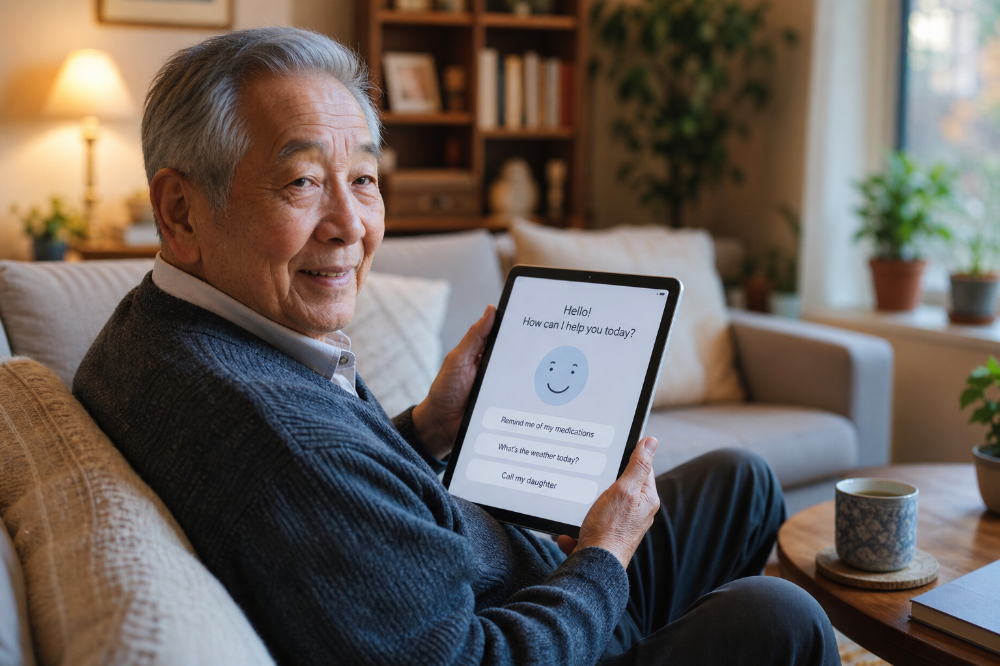
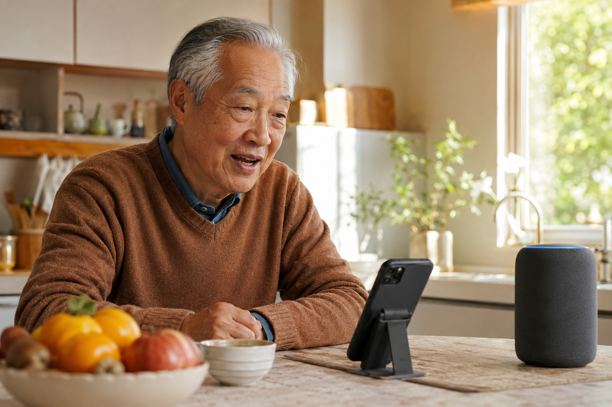
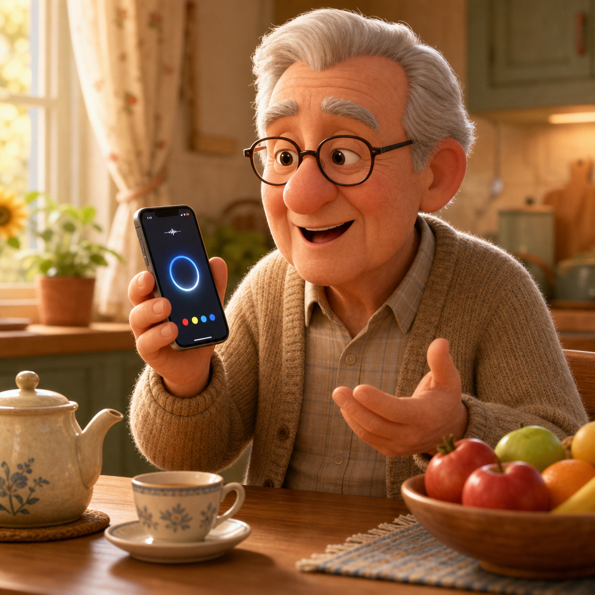
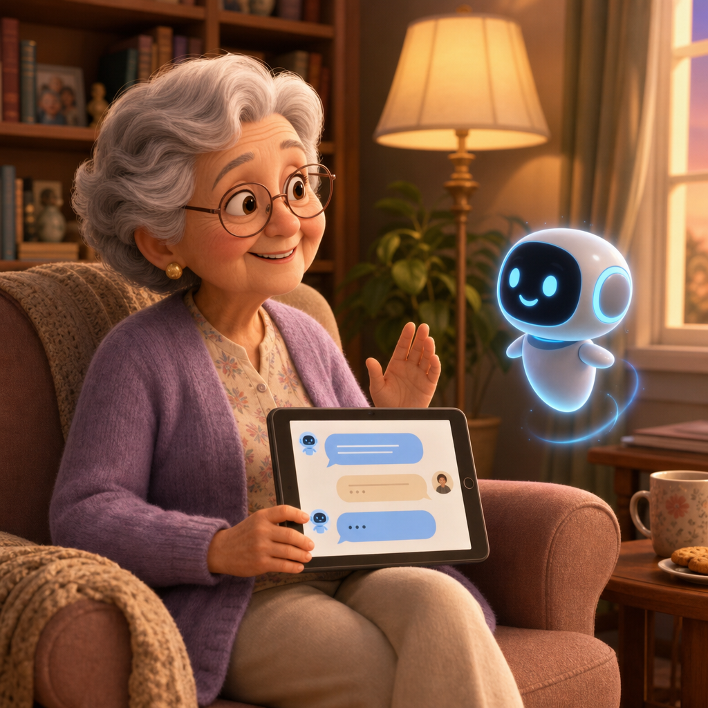
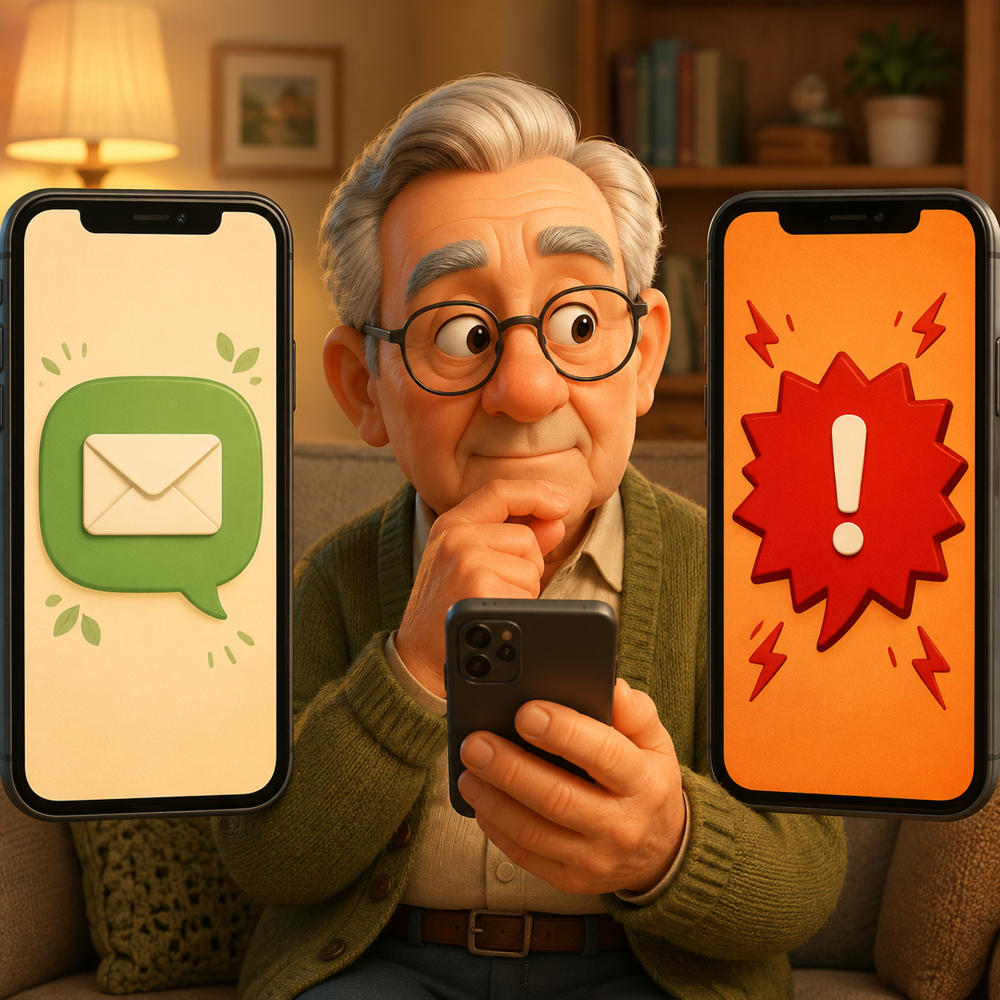

# 認識 AI：什麼是人工智慧？

> 人工智慧不是機器人，也不是科幻電影——它就在您每天使用的手機和電視裡。



## AI 是什麼？

### 最簡單的解釋

- AI（人工智慧）就是「讓電腦學會思考和判斷」的技術
- 就像訓練小孩識字一樣，工程師用大量資料「教」電腦認識事物
- AI 不是一個機器人，而是一種技術，藏在各種我們熟悉的工具裡

> **您已經在使用 AI 了**
> 每次手機自動調亮螢幕、電視推薦您可能喜歡的節目、導航軟體自動避開塞車路段——這些都是 AI 在幫您工作。

### AI 的三種常見形式

[tags]
- [blue] 聽懂語音的 AI（語音助理）
- [green] 看懂影像的 AI（人臉辨識、照片整理）
- [purple] 會對話的 AI（聊天機器人）
[/tags]

### AI 與傳統電腦程式的差別

[compare label-left="傳統電腦程式" label-right="AI 程式"]
- 按照工程師寫好的固定規則執行 | 從大量例子中「學習」，找出規律
- 沒有規則就不會做事 | 能處理沒見過的新情況
- 像食譜：只能做書上的菜 | 像廚師：能即興創作新料理
- 結果永遠相同，不會變好 | 用得越多，回答越準確
[/compare]


[callout type="tip" title="簡單記住一句話"]
傳統程式是「按規則辦事」，AI 是「自己學會辦事」——這就是為什麼 AI 越用越聰明。
[/callout]

---

# 生活應用：AI 如何幫助我們？

> AI 最大的價值，是讓原本困難的事情變得輕鬆，讓您更有尊嚴地生活。


## 健康與醫療

### 健康監測助手

- 智慧手錶可以全天監測心跳、血壓、血氧
- 異常時自動通知家人或緊急聯絡人
- 記錄運動量、睡眠品質，提醒按時服藥

> **AI 不取代醫生，但能更早發現問題**
> 許多長輩因為智慧手錶偵測到心律不整，及時就醫避免了更嚴重的狀況。這是 AI 最有意義的應用之一。


### AI 視訊問診

- 不需要出門，直接用手機或平板與醫生視訊
- AI 協助翻譯醫學術語，讓說明更容易理解
- 適合行動不便或住在偏遠地區的長輩

## 居家生活

### 智慧音箱：開口就能完成的事

[flow]
1. 說「播放鄧麗君的歌」— 立即播放熟悉的音樂
2. 說「明天天氣怎麼樣」— 獲得即時天氣預報
3. 說「提醒我下午三點吃藥」— 自動設定提醒
4. 說「打電話給女兒」— 免撥號直接聯絡家人
[/flow]

### 防詐騙 AI 守護

- AI 可以識別詐騙電話的語音模式，自動攔截或提醒
- 分析可疑簡訊連結，避免誤點入詐騙網站
- 家人可以設定「陌生人來電提醒」，讓您更安心接聽

[callout type="warning" title="詐騙第一防線：先暫停三秒"]
任何要求「匯款」「提供帳號密碼」「點擊連結」的訊息，先暫停，告訴家人再說。
即使對方說自己是「兒女」「警察」「銀行」，也都要先掛斷，再用自己熟悉的電話打回去確認。
[/callout]

### 想想看：您今天用過 AI 了嗎？

[reveal title="點開看看答案"]
其實您可能已經用過好幾次：

- 早上看天氣 App，AI 在分析雲圖預測降雨
- 打開 LINE，AI 在過濾垃圾訊息
- 看 YouTube 影片，AI 在推薦您可能喜歡的下一支
- 用相機拍照，AI 在自動對焦人臉與美化
- 撥電話前看到「疑似詐騙」警示，是 AI 在保護您

AI 已經自然地融入生活，您不需要做任何事，它就在背景默默幫忙。
[/reveal]

---

# 實用工具：動手試試看

> 最好的學習方式，就是親自體驗。這些工具都是免費的，而且專為初學者設計。



## 語音助理

### 在您的手機上找到語音助理

[tabs]
[tab label="iPhone（蘋果手機）"]
- 對著手機說「嘿 Siri」就能啟動
- 或按住手機右側的開機鍵 1 秒
- Siri 圖示是一個彩色的圓圈
- 第一次使用會請您錄一段聲音，讓 Siri 認識您
[/tab]
[tab label="Android（安卓手機）"]
- 對著手機說「Hey Google」或「OK Google」
- 或長按螢幕底部的橫線往上滑
- Google 助理圖示是四色圓點
- 設定 → Google → 設定 Voice Match 即可啟用語音喚醒
[/tab]
[/tabs]



### 試著對它說這些話

```prompt [label="可以這樣說"]
「今天台北天氣怎麼樣？」
「幫我設定明天早上八點的鬧鐘」
「最近的便利商店在哪裡？」
「幫我傳訊息給兒子，說我今天回來吃晚飯」
```

### 使用語音助理的小訣竅

- 說話速度放慢一點，口齒清晰
- 一次只問一件事，不要問太多問題
- 聽不懂時可以重說，或換一種說法
- 不確定怎麼說就直接問：「你能幫我做什麼？」

## AI 聊天機器人

### ChatGPT 和 Gemini：像真人一樣對話

- 可以問任何問題，從食譜到健康知識都可以
- 可以請它用更簡單的方式重新解釋
- 幫您寫賀卡、整理思路、翻譯外文訊息

```prompt [label="試試這些問題"]
「我最近膝蓋痠痛，有什麼可以做的保健運動？請用簡單的方式說明。」
「幫我寫一張中秋節賀卡，給老朋友用的，要溫馨一點。」
「這段英文是什麼意思？（貼上英文內容）」
```

[callout type="warning" title="AI 說的話，需要再確認"]
AI 聊天機器人有時候會說錯（這叫「AI 幻覺」）。
醫療、法律、財務等重要決定，一定要再諮詢專業人士，不能只依賴 AI 的回答。
[/callout]



## 照片與影像 AI

### 手機相機裡的 AI 功能

[flow]
1. 自動美化人像 — 不需要修圖技巧，拍完自動變好看
2. 場景辨識 — 拍食物、風景、寵物，AI 自動調整最佳設定
3. 舊照片修復 — 將泛黃或模糊的老照片變得清晰
4. 人臉整理 — 自動把同一個人的照片歸類在一起
[/flow]

## 常見問題

[accordion]
[item title="我不會打字，能用 AI 嗎？" open]
完全可以。語音助理（Siri、Google 助理）和大部分 AI 工具都支援「說話輸入」，不需要打字。
按住麥克風圖示，直接說話即可，比打字還快。
[/item]
[item title="使用 AI 要付費嗎？"]
基本功能都是免費的：

- Siri、Google 助理：手機內建，免費
- ChatGPT、Gemini：免費版完全夠用
- 收費的版本通常是給商業用戶或開發者，長輩日常使用免費版就好
[/item]
[item title="我擔心被 AI 監聽，安全嗎？"]
語音助理只在「聽到喚醒詞」（如「嘿 Siri」）後才開始錄音。
不過為了安心，可以：

- 在手機「設定 → 隱私」關閉不需要的權限
- 不放在臥室或浴室
- 不確定的時候，關掉語音助理的「總是聆聽」功能
[/item]
[item title="家人不在身邊，遇到問題誰能教我？"]
- 問語音助理本身：「你能幫我做什麼？」
- 撥打手機品牌客服（Apple、三星、Google 都有中文服務）
- 參加澳門科學館的長輩科技課程
- 善用本課程的內容反覆練習，熟能生巧
[/item]
[/accordion]

---

# 安全守則：聰明使用 AI

> 使用 AI 就像用菜刀，知道正確用法，就是非常有用的工具。


## 個人資料保護

### 什麼資料不能給 AI

- 身分證號碼、健保卡號
- 銀行帳號、信用卡號碼
- 電話號碼、家庭住址
- 各種帳號的密碼

> **記住這個原則：AI 不需要知道您是誰**
> 合法的 AI 工具不會要求您提供個人身分資料。如果有工具要求您「驗證身份」並要求提供證件，這很可能是詐騙。

### 安全使用的好習慣

[tags]
- [green] 使用官方 App，不隨意下載不明程式
- [green] 定期更新手機系統和 App
- [green] 重要決定告訴家人，不單獨行動
- [orange] 免費優惠、中獎通知，先冷靜再判斷
- [orange] 陌生連結不點，即使看起來像認識的人傳的
[/tags]

## 辨別真假資訊

### AI 生成的假影片和假聲音

- 現在的 AI 可以製作看起來很真實的假影片
- 甚至可以複製某人的聲音，打電話給您假裝是家人
- 聽到「緊急需要錢」的要求，一定要先掛斷，直接撥打家人的號碼確認

### 真實訊息 vs 詐騙訊息

[compare label-left="可信的真實訊息" label-right="可疑的詐騙訊息"]
- 內容平靜、不急迫 | 語氣緊急、催您馬上行動
- 不會要求轉帳或提供密碼 | 要求「立刻匯款」「提供帳號」
- 認識的人用平常的方式聯絡 | 陌生號碼、模糊的「我是你兒子」
- 機構訊息有正式名稱與電話 | 連結網址奇怪、有拼音錯誤
- 有疑問可以慢慢確認 | 不讓您掛電話、不准您問家人
[/compare]



### 三個確認步驟

[flow]
1. 暫停 — 不要馬上回應，冷靜想一想
2. 確認 — 用其他方式聯絡當事人，確認消息是否真實
3. 諮詢 — 有疑問就問家人或打 165 反詐騙專線
[/flow]

### 安全檢查清單

[steps-status]
- [todo] 手機系統已更新到最新版本 | 設定 → 一般 → 軟體更新
- [todo] 已開啟手機的「不明來電辨識」功能 | 電信業者或內建功能
- [todo] 已將 165 反詐騙專線加入聯絡人 | 撥打前不用查號碼
- [todo] 已告訴家人「遇事先問」的約定 | 任何匯款都先問家人
- [todo] 銀行 App 已開啟交易通知 | 任何金錢進出立刻收到通知
[/steps-status]

[callout type="warning" title="一句話保命口訣"]
「要錢的就是詐騙，掛電話再說。」
不論對方說自己是誰，只要牽涉到金錢、密碼、個資，先掛斷、再向家人或 165 確認。
[/callout]

---

# 一起學習：課程總結

> 每一個問題都是學習的開始，每一次嘗試都讓您更靠近科技的美好。

## 今天學到了什麼


[summary]
- **AI 是生活助手** | 不是機器人，就在您的手機和電視裡，每天默默幫助您
- **健康更有保障** | 智慧手錶、AI 問診，讓健康監測更方便、更即時
- **開口就能完成** | 語音助理讓不擅打字的長輩也能輕鬆使用科技
- **聰明不被騙** | 個人資料要保護，可疑訊息先暫停、再確認
[/summary]

## 自我檢測：您學會了嗎？

[quiz type="single"]
Q: 接到電話自稱是「兒子」，要您立刻匯錢救急，您應該怎麼做？
- [ ] 馬上匯款，怕兒子有危險
- [x] 先掛電話，再用平常的號碼打給兒子確認
- [ ] 詳細問對方狀況，再決定要不要匯
- [ ] 把電話交給隔壁鄰居處理
Hint: 真正的家人不會在電話裡反對您打去確認。
[/quiz]

[quiz type="bool"]
Q: AI 聊天機器人的回答，醫療、法律、財務都可以完全相信？
- [ ] 是
- [x] 否
Hint: AI 可能會說錯，重要決定一定要再諮詢專業人士。
[/quiz]

[quiz type="single"]
Q: 以下哪個是「您已經在用 AI」的例子？
- [ ] 用算盤算錢
- [ ] 看紙本報紙
- [x] 手機自動把同一個人的照片歸類
- [ ] 用鑰匙開門
Hint: AI 在背景默默幫您做的事，通常和「辨識」「整理」「推薦」有關。
[/quiz]

## 下一步行動

### 今天回家就能試試

- 在手機上試試語音助理，問它一個您好奇的問題
- 請家人或孫子幫您開啟一個智慧音箱，體驗語音控制
- 如果有智慧手錶，開啟健康監測功能
- 把 165 反詐騙專線加入聯絡人

### 持續學習的資源

[callout type="tip" title="學習不必獨自摸索"]
- 澳門科學館持續提供長輩科技課程，可帶家人一起來
- 遇到不會的功能，直接問語音助理「你能幫我做什麼？」
- 善用本課程的 QR code 重複觀看，熟能生巧
- 把學到的分享給其他長輩朋友，一起變聰明
[/callout]

> **科技學習沒有年齡限制**
> 澳門科學館持續提供長輩科技課程，歡迎帶著家人一起來參加，讓學習變成溫馨的家庭時光。
