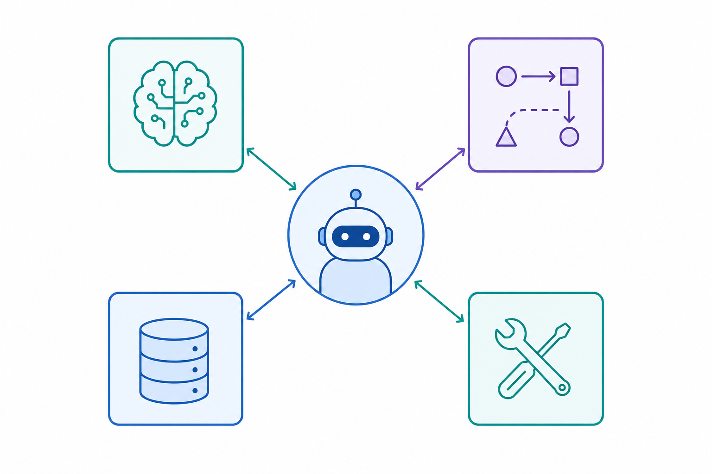
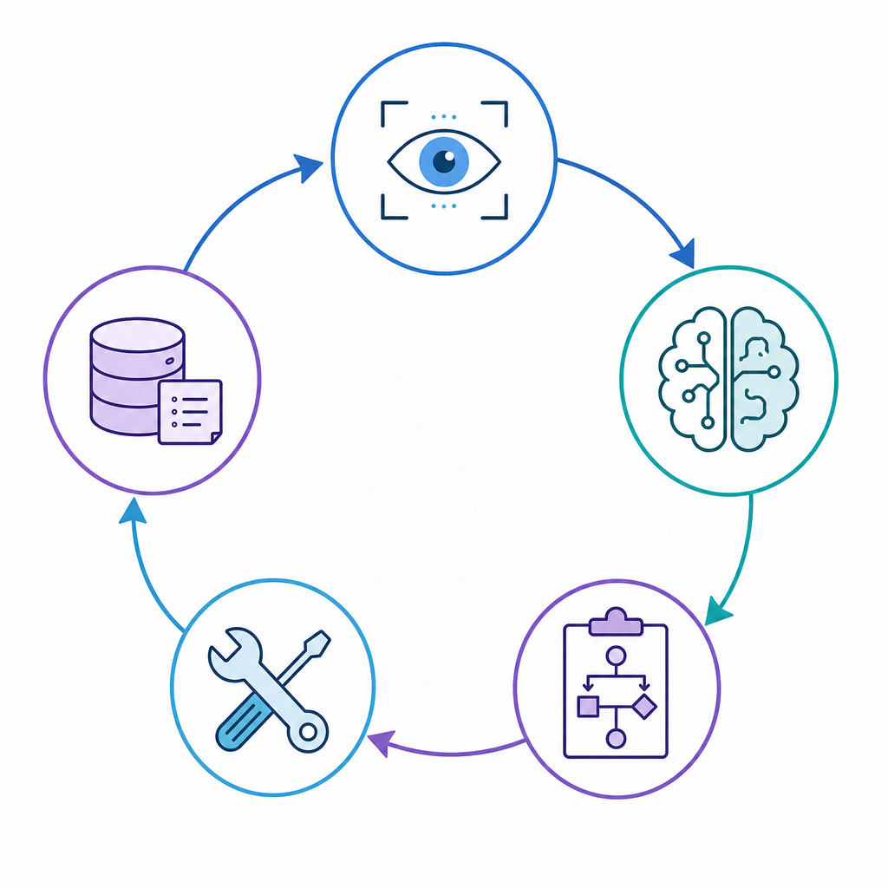
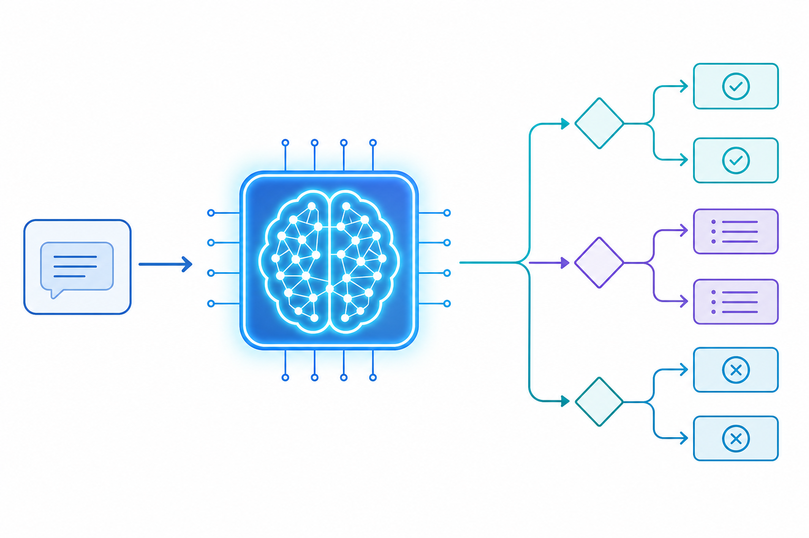
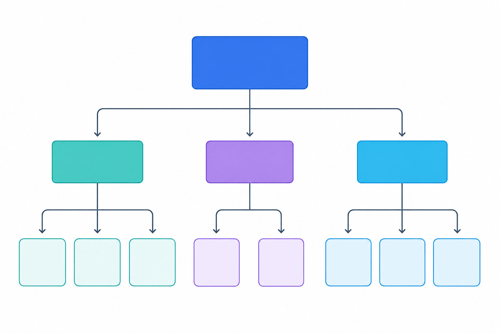
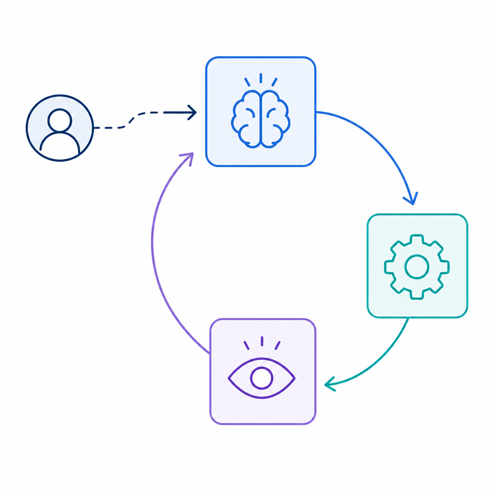
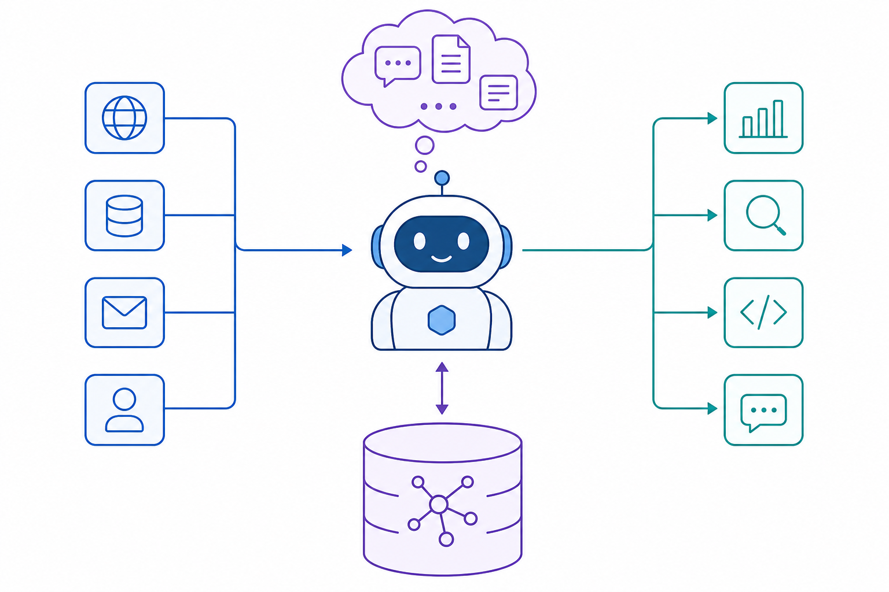
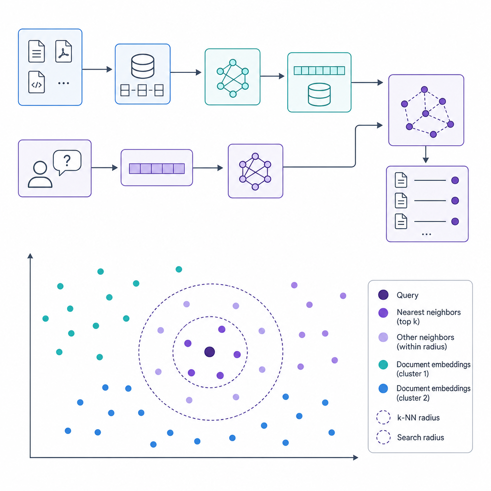
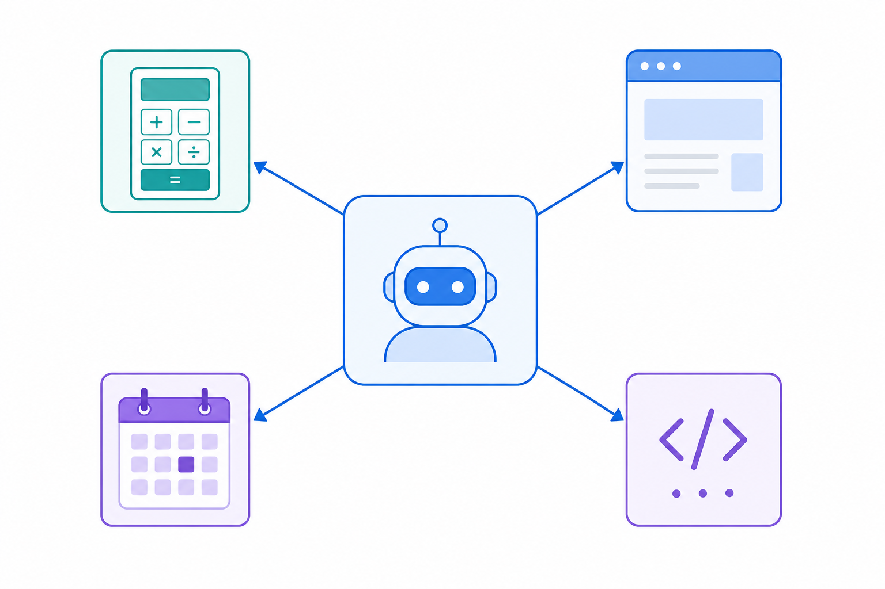
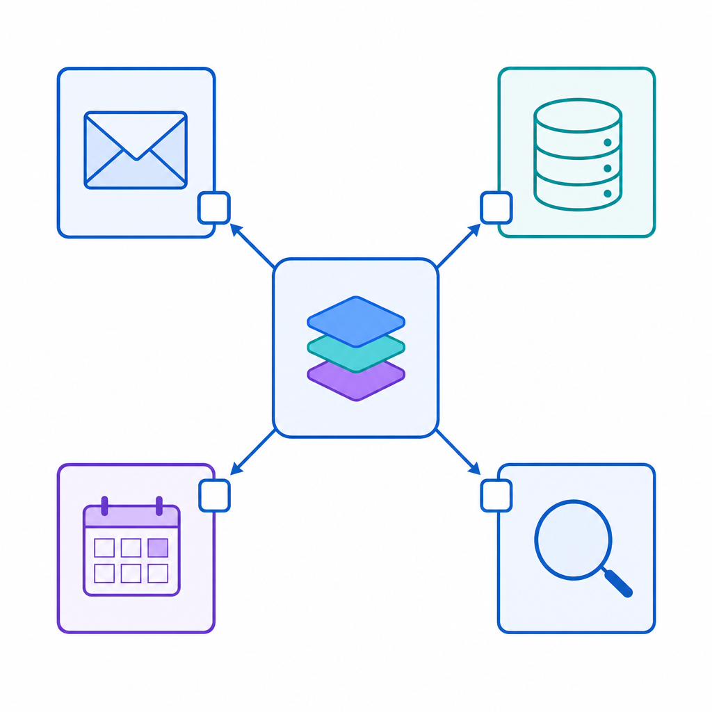
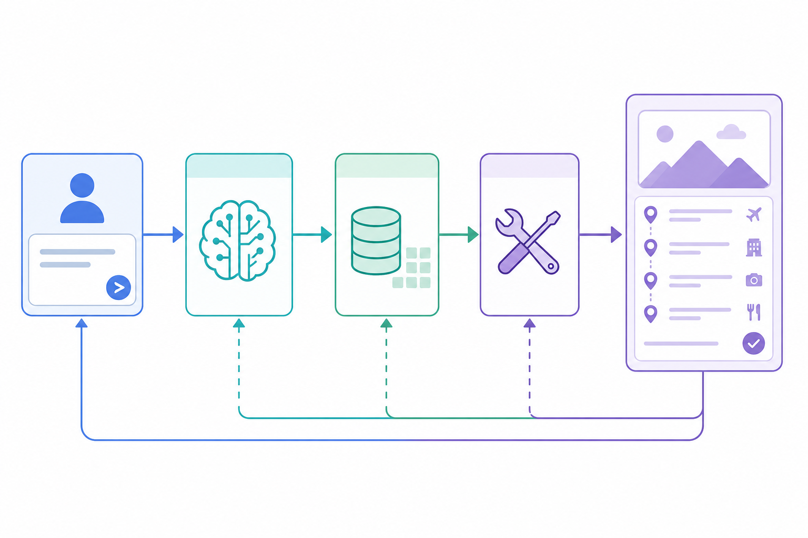

# 破冰：從 ChatGPT 談起
> 大家都用過 ChatGPT，但它真的是「AI Agent」嗎？這一章先拆解最常見的誤解，建立後續學習的基礎。

## 你以為的 AI，其實只是聊天機器人

### 先來一場小調查

[vote id="v1" title="你每天會使用哪一種 AI 工具？"]
- ChatGPT / Claude 這類對話機器人
- Siri / Google Assistant 語音助理
- 推薦系統（Netflix / YouTube / Shopee）
- 以上都用過
- 我幾乎不用 AI
[/vote]

### 這些「AI」有什麼共同點？
- 你給一個輸入，它給一個輸出 — 一次問答、一次任務
- 不會主動拆解步驟，也不會自己去找資料
- 出錯了不會自己修正，而是回一段錯誤訊息給你
- 每次都像跟一個「失憶的天才」對話，前一句說過的事，下一句可能又忘了

### 這就是「傳統 AI」
- 學術上稱為 Narrow AI（狹義 AI）或 Task-Specific AI
- 擅長做**一件事**：翻譯、分類、辨識、生成文字
- 沒有「任務感」 — 不知道自己在做什麼、做到哪裡、接下來要做什麼

> **會回答問題，不等於有智慧**
> ChatGPT 能寫文章、解數學、翻譯，但它本質上是在「預測下一個字」。
> 它不會為了幫你規劃旅行，主動去查機票、比價、排行程 — 除非你每一步都自己餵給它。
>
> **AI Agent 的出現，就是為了讓 AI 從「回答問題」升級成「完成任務」。**

## 什麼是 AI Agent？一句話定義

### 一句話版本

```prompt [label="AI Agent 定義"]
AI Agent = LLM（大腦）+ Planning（規劃）+ Memory（記憶）+ Tools（工具）
          能自主拆解任務、呼叫外部工具、反思修正，直到目標達成的系統
```

### 生活類比：管家 vs 翻譯機
- **傳統 AI 像翻譯機**：你說一句它譯一句，沒有上下文、沒有主動性
- **AI Agent 像私人管家**：你說「幫我辦一場生日派對」，管家會自己拆解任務（訂場地、買蛋糕、邀請朋友）、遇到場地滿了會主動換一家、記得你上次說過不喜歡氣球

### 為什麼現在才紅？

[tags]
- [green] LLM 夠聰明 — GPT-4 / Claude 具備推理能力，能當「大腦」
- [blue] 工具夠普及 — API、瀏覽器自動化、向量資料庫都成熟了
- [purple] 框架夠完善 — LangChain、AutoGen、CrewAI 降低了開發門檻
- [orange] 需求夠明確 — 企業需要自動化更複雜的工作流，不只是聊天
[/tags]

---

# 傳統 AI vs AI Agent：一場完整的對比
> 在談四大元件之前，先把「傳統 AI」跟「AI Agent」放在一起逐項對比，看清楚兩者的本質差異。

## 從一個生活情境看起

### 情境：你想規劃一趟五天四夜的日本旅行

[compare label-left="傳統 AI（ChatGPT）" label-right="AI Agent（旅遊管家）"]
- 你問：「幫我規劃日本五天行程」 \| 你說：「幫我規劃日本五天行程」
- 它回一篇範本行程，內容可能是過時的 \| 它主動問你：出發日期、預算、興趣
- 你再問：「這家飯店還有房嗎？」 \| 它自己呼叫訂房 API，查詢即時房況
- 它回答：「我無法查詢即時資訊」 \| 沒房？自動換下一家同等級飯店
- 你得自己開 Agoda、Google Map、航班比價網 \| 它把機票、飯店、景點全部排進一份行程
- 每次對話都從零開始 \| 記得你上次說過不吃生魚片、喜歡靠窗座位
[/compare]

### 看出差異了嗎？

[flow]
1. 傳統 AI — 你驅動每一步，AI 只負責回答
2. AI Agent — 你給目標，AI 自己拆解、執行、修正
3. 關鍵差別 — 有沒有「自主性」（Autonomy）
[/flow]

## 結構化對比：八個關鍵維度

### 逐項比較表

[compare label-left="傳統 AI" label-right="AI Agent"]
- 單輪問答 \| 多步驟任務
- 無狀態，每次重新開始 \| 有記憶，跨對話延續
- 只會生成文字 \| 能呼叫工具、改寫現實世界
- 出錯等使用者發現 \| 出錯自我反思、主動修正
- 一個模型做一件事 \| 多模型或多 Agent 協作
- 被動回應 \| 主動規劃與決策
- 依賴 Prompt 品質 \| 依賴任務拆解與工具串接
- 適合單純任務（翻譯、分類） \| 適合複雜任務（研究、自動化、營運）
[/compare]

> **不是取代，而是分工**
> 傳統 AI 擅長做一個精準的元件：分類器、翻譯器、生成器。
> AI Agent 擅長把多個元件串起來，完成一個完整的任務。
>
> **Agent 裡面通常就包含了傳統 AI** — 它是把 AI 升級成「有手有腳」的系統，而不是另一種對立的東西。

## 一段互動看兩者的程式差異

### 傳統 AI 的呼叫方式

```prompt [label="傳統 AI — 一次問答"]
User: "東京五天行程怎麼排？"
AI:   "Day 1: 淺草...Day 2: 涉谷..."
User: "這家飯店有空房嗎？"
AI:   "我無法查詢即時資訊，請自行上官網確認。"
```

### AI Agent 的運作流程

```prompt [label="AI Agent — 任務循環"]
User: "幫我規劃東京五天，預算 5 萬，喜歡美食"
Agent 思考: 目標 = 規劃行程，限制 = 5 萬，偏好 = 美食
Agent 行動 1: call flight_api.search("TPE-NRT", dates)
Agent 行動 2: call hotel_api.search("Tokyo", budget=3000/night)
Agent 反思:   發現第一天飯店太遠，重新調整順序
Agent 行動 3: call google_places.nearby("美食", loc=shinjuku)
Agent 輸出:   完整行程表 + 預約連結 + 預算分配表
```

### 你看到的差別是？
- 傳統 AI：**一次完成**，結果無法驗證
- AI Agent：**思考 → 行動 → 觀察 → 反思**，循環直到任務完成
- 這個循環叫做 **ReAct**（Reasoning + Acting），是 Agent 的核心模式

[quiz type="single"]
Q: 下列哪一項最能描述 AI Agent 與傳統 AI 的本質差異？
- [ ] 模型參數更多
- [ ] 回應速度更快
- [x] 能自主拆解任務、呼叫工具、反思修正
- [ ] 可以回答更多種類的問題
Hint: 關鍵在「自主性」，不是模型大小或速度。
[/quiz]

---

# 核心架構：AI Agent 的四大元件
> 大腦、規劃、記憶、工具 — 這四件事加起來，才構成一個真正的 AI Agent。本章是整堂課的核心地圖。

## 一張圖看懂 Agent 架構



### 四大元件的角色

[flow]
1. **Brain（大腦）** — 理解指令、推理、做決策，由 LLM 擔任
2. **Planning（規劃）** — 把大任務拆成小步驟，遇到問題會自我修正
3. **Memory（記憶）** — 短期記對話、長期記偏好與經驗
4. **Tools（工具）** — 伸出手和腳，跟現實世界互動
[/flow]

### 它們怎麼一起工作？

[image-text position="right" width="45"]


使用者給一個模糊的目標（例如「幫我辦一場生日派對」），Agent 內部的四大元件會進入一個持續循環：

- **感知**：接收使用者輸入與環境回饋
- **思考**：大腦（LLM）推理出下一步
- **規劃**：拆成可執行的子任務
- **行動**：呼叫對應的工具
- **記憶**：把結果寫入短期或長期記憶
[/image-text]

> **Agent 不是一個模型，而是一個系統**
> 很多人以為換一個更強的 LLM 就能讓 Agent 變強，其實不然。
> 真正的瓶頸通常在：規劃邏輯寫得不夠好、工具串接不夠穩、記憶設計不符合情境。
>
> **LLM 只是大腦，但一個人光有大腦是無法成事的。**

## 四大元件速覽表

### 本章節地圖

| 元件 | 對應章節 | 關鍵技術 | 一句話定義 |
| --- | --- | --- | --- |
| Brain | 下一章 | GPT-4、Claude、Gemini | 理解與推理的引擎 |
| Planning | 第 5 章 | ReAct、ToT、CoT | 拆解任務、自我修正 |
| Memory | 第 6 章 | Context Window、向量資料庫 | 短期與長期記憶 |
| Tools | 第 7 章 | Function Calling、API、MCP | 與現實世界互動的手腳 |

---

# 元件一：核心大腦 (The Brain / LLM)
> LLM 是 Agent 的思考引擎 — 它負責理解模糊指令、推理、做決策。但「聰明」不代表「可靠」，這一章談怎麼選大腦、怎麼用大腦。



## LLM 如何成為 Agent 的大腦？

### 為什麼是 LLM，不是傳統程式？
- 傳統程式要**明確指令**：`if 價格 > 1000 then 太貴`
- 現實任務是**模糊的**：「幫我找 CP 值高的飯店」— CP 值是什麼？多高算高？
- LLM 厲害的地方：**理解模糊語言，產出結構化決策**

### 大腦要做的三件事

[flow]
1. **理解（Understand）** — 把使用者的模糊話，轉成清晰的內部表示
2. **推理（Reason）** — 根據已知資訊，推導出下一步該做什麼
3. **決策（Decide）** — 在多個選項中選一個，或決定要收集更多資訊
[/flow]

### 一段推理過程長什麼樣？

```prompt [label="Agent 內部的思考（Chain of Thought）"]
User: "我想請假三天去日本，幫我看看合不合理"

Brain 思考:
1. 請假三天，加上週末兩天，總共五天
2. 東京來回飛行約 8 小時，五天扣掉交通剩三天完整玩
3. 使用者偏好未知 — 需先詢問：目的地城市、出發日期、興趣
4. 決定先回應：請假天數合理，但需要更多資訊才能規劃
```

> **看得見的推理，才能被信任**
> 傳統 AI 給你一個答案，你不知道它是怎麼來的。
> AI Agent 通常會把「思考過程」寫出來（Chain of Thought），讓你看到它為什麼這樣決定。
>
> 這不是為了炫技，而是為了**可解釋性** — 在醫療、金融、法務等高風險場景，看不見推理過程的 AI 是不能被信任的。

## 市面上有哪些大腦可選？

### 主流 LLM 比較

[compare label-left="Claude (Anthropic)" label-right="GPT-4 (OpenAI)"]
- 長上下文 200K tokens \| 長上下文 128K tokens
- 推理細膩、指令遵循度高 \| 生態系完整、工具整合豐富
- 擅長長文分析、程式碼 \| 擅長多模態、通用任務
- API 價格中高 \| API 價格中高
[/compare]

[compare label-left="Gemini (Google)" label-right="開源模型（Llama / Qwen）"]
- 超長上下文 1M+ tokens \| 上下文 8K–128K 不等
- 與 Google 生態深度整合 \| 可自架，資料隱私可控
- 擅長大規模文件分析 \| 適合預算有限或高隱私場景
- 雲端為主 \| 可在地端部署
[/compare]

### 怎麼挑選合適的大腦？

[tags]
- [green] 看任務類型 — 長文分析、程式碼、多模態、即時資訊
- [blue] 看成本 — Token 單價 x 預估用量
- [purple] 看隱私 — 資料能否出境？是否要在地端跑？
- [orange] 看延遲 — 有些 Agent 需要毫秒回應，有些可以等
[/tags]

## 動手看看你的大腦有多聰明

### 練習：三個問題測試 LLM 的推理能力

- [x] 問題 1（事實）：「日本首都？」 — 測試基本知識
- [x] 問題 2（推理）：「我有 3 顆蘋果，吃 1 顆買 2 顆，剩幾顆？」 — 測試多步驟推理
- [x] 問題 3（模糊）：「幫我推薦一間 CP 值高的餐廳」 — 測試處理模糊指令

```prompt [label="觀察重點"]
第三題最容易看出大腦的品質：
- 弱的大腦 — 直接丟一家餐廳名字給你
- 強的大腦 — 會反問你「你在哪個城市？預算？口味偏好？」
這個「主動追問」的能力，就是 Agent 能不能做事的關鍵
```

### 大腦的限制

[flow]
1. 幻覺（Hallucination）— 會自信地說出錯的東西
2. 知識截止日 — 不知道昨天發生的事（除非搭配工具）
3. 數學不可靠 — 大數運算常常錯，要交給計算機工具
4. 沒有持久記憶 — 每次對話都從零開始（除非搭配記憶系統）
[/flow]

> **大腦是起點，不是全部**
> 選對 LLM 很重要，但它只能解決「理解與推理」這一塊。
> 要讓 Agent 真的能完成任務，還需要：規劃、記憶、工具。
> 下一章就來談「規劃」 — 怎麼讓大腦把一個大任務，拆成一串可執行的小步驟。

[quiz type="single"]
Q: 為什麼 AI Agent 通常會把「思考過程」寫出來？
- [ ] 為了讓回應看起來更長、更有誠意
- [ ] 因為 LLM 沒辦法直接給出答案
- [x] 為了讓使用者能檢視推理邏輯，提升可解釋性
- [ ] 為了降低 API 成本
Hint: 想一下醫療或金融場景，為什麼不能只看結論。
[/quiz]

---

# 元件二：規劃能力 (Planning)
> 有了大腦還不夠，Agent 要能把「幫我辦派對」這種模糊指令，拆成一串可執行的步驟，遇到問題還會自己繞路 — 這就是規劃能力。



## 拆解子任務：把大象放進冰箱

### 一個經典笑話的啟示

```prompt [label="把大象放進冰箱要幾步？"]
傳統 AI 回答: "這是不切實際的問題"
Agent 回答:
  Step 1. 確認大象尺寸與冰箱容量
  Step 2. 若冰箱不夠大 -> 呼叫租賃服務，找大型冷藏櫃
  Step 3. 若大象無法移動 -> 聯絡專業搬運團隊
  Step 4. 執行搬運 -> 關門 -> 確認溫度
  Step 5. 回報任務完成
```

### 任務拆解的兩種主流方法

[compare label-left="由上而下（Top-Down）" label-right="由下而上（Bottom-Up）"]
- 先把大目標切成 3–5 個主軸 \| 先列出所有可想到的動作
- 再逐層展開成子任務 \| 再把動作群組成階段
- 適合目標清晰的任務 \| 適合探索型任務
- 例：辦婚禮 -> 場地、婚紗、賓客 \| 例：研究新市場 -> 先蒐集各種訊號
[/compare]

### 真實案例：規劃五天四夜的日本旅行

[flow]
1. 主目標 — 五天四夜日本行程
2. 拆成四大軸 — 交通、住宿、景點、餐飲
3. 每軸再展開 — 交通：機票、機場接送、市內交通
4. 加上時序 — Day 1 到 Day 5 的每日行程
5. 加上預算 — 分配每軸預算上限，總和不超過 5 萬
[/flow]

> **拆解任務，是 Agent 最被低估的能力**
> 人類主管最值錢的能力，不是自己做，而是知道怎麼把工作分給別人做。
> AI Agent 也是一樣 — 能不能把一個模糊目標拆成 5 到 10 個可執行的子任務，
> 決定了它是「只會聊天的玩具」還是「能做事的助手」。

## 反思與修正：Self-Reflection

### 為什麼需要反思？

[flow]
1. 任務執行過程中，一定會遇到意外 — 飯店沒房、API 掛掉、資料不全
2. 傳統程式 — 拋出例外、停止、等人類處理
3. Agent — 觀察失敗 -> 反思原因 -> 嘗試替代方案 -> 繼續執行
[/flow]

### 一個 Self-Reflection 的真實循環

```prompt [label="Agent 自我修正的內心戲"]
目標: 幫使用者訂一家 budget < 5000 的飯店

行動 1: 查詢 "Hotel A" -> 回應: 無房
反思 1: 這家沒房，可能原因 = 旺季。應嘗試同區其他飯店
行動 2: 查詢 "Hotel B" (同區, 4800/晚) -> 回應: 有房
反思 2: 價格符合，但使用者上次說過不喜歡太舊的飯店
行動 3: 查詢 Hotel B 的評價 -> 回應: 4.2 星, 2019 年翻修
反思 3: 符合使用者偏好，可推薦
輸出: 推薦 Hotel B，附上理由與預訂連結
```

### ReAct 模式：思考與行動交替

[image-text position="left" width="45"]


ReAct = Reasoning + Acting，是目前最主流的 Agent 運作模式：

- **Thought** — 思考現在該做什麼
- **Action** — 呼叫某個工具執行
- **Observation** — 觀察工具回傳的結果
- 再回到 Thought，直到任務完成或達到最大步數
[/image-text]

### 規劃失敗的常見情境

- [x] 任務拆太粗 — Agent 不知道下一步做什麼，卡住
- [x] 任務拆太細 — 步驟太多，超出最大步數限制
- [x] 無限循環 — 在兩個失敗方案間來回跳，出不來
- [x] 沒有備案 — 所有子任務都假設會成功，一失敗就整個垮

## 動手體驗規劃

### 練習：設計一個「會議安排 Agent」

```prompt [label="任務描述"]
目標: 幫使用者安排一場 5 人跨部門會議
可用工具: Google Calendar API、會議室預約系統、Email
```

- [x] 第一步：取得 5 個人的可用時段（呼叫 Google Calendar）
- [x] 第二步：找出共同空檔（推理：交集）
- [x] 第三步：預約會議室（呼叫預約 API）
- [x] 第四步：若會議室被佔，自動換一間（反思 + 替代方案）
- [x] 第五步：發送邀請 Email 給所有人（呼叫 Email）
- [x] 第六步：把會議寫入日曆（呼叫 Google Calendar 寫入）

### 進階規劃技術（延伸補充）

[bonus title="三種進階規劃技術"]
除了 ReAct，還有兩種常見技術：

**Chain-of-Thought (CoT)** — 讓 LLM 一步一步寫出推理過程，提升準確率。例如「先算 X，再算 Y，最後 Z」。

**Tree-of-Thought (ToT)** — 不只一條路徑，而是同時探索多條推理分支，評估每條路徑後選最佳。適合複雜決策場景。

**Plan-and-Execute** — 先一次性生成完整計畫，再逐步執行。與 ReAct 的「邊走邊想」不同，適合任務結構明確的場景。
[/bonus]

[quiz type="single"]
Q: Agent 在執行任務時發現「預訂的餐廳已客滿」，下一步最適當的做法是？
- [ ] 直接回報任務失敗，請使用者自行處理
- [x] 觀察原因、反思、嘗試附近同類型餐廳作為替代方案
- [ ] 忽略這個錯誤，繼續執行後續步驟
- [ ] 停止所有行動，等待人類介入
Hint: Agent 的關鍵特質之一就是自我修正，而不是被動等待。
[/quiz]

---

# 元件三：記憶系統 (Memory)
> 沒有記憶的 Agent，就像一個失憶的管家 — 你昨天說過不吃辣，今天它又推薦麻辣鍋。記憶系統讓 Agent 能延續對話、累積經驗、越來越懂你。



## 短期記憶：對話上下文

### 什麼是短期記憶？
- 就是 LLM 的 **Context Window** — 一次對話能塞進多少 tokens
- GPT-4: 128K tokens、Claude: 200K、Gemini: 1M+
- 對話過程中，每一句你說的、AI 回的，都會累積在 context 裡

### 短期記憶的運作方式

```prompt [label="一段對話的 context 累積"]
Turn 1: User="我想去日本"      -> Context 長度 20 tokens
Turn 2: User="預算 5 萬"        -> Context 長度 50 tokens
Turn 3: User="不喜歡太冷的地方"  -> Context 長度 100 tokens
Turn 4: User="推薦一下行程"      -> Agent 根據上述 3 句一起推理
```

### 短期記憶的限制

[tags]
- [orange] 有限容量 — 超過 context window，舊的內容會被丟掉
- [purple] 無法跨對話 — 關掉瀏覽器，context 就消失了
- [blue] 成本隨長度增加 — token 越多，API 費用越高
- [green] 需要管理策略 — 不是所有對話都該保留
[/tags]

### 管理短期記憶的常見策略

[compare label-left="全部保留" label-right="摘要式壓縮"]
- 最簡單，不丟任何資訊 \| 定期請 LLM 把對話總結成一段
- 適合短對話（< 20 輪） \| 適合長對話（> 50 輪）
- 容易超出 context window \| 可能丟失細節，但保留主軸
- Token 成本高 \| Token 成本可控
[/compare]

## 長期記憶：跨對話的知識庫

### 為什麼需要長期記憶？
- 使用者今天關掉瀏覽器，明天回來，希望 Agent 還記得他
- 企業導入 Agent，希望它記得所有員工的偏好、歷史任務、失敗經驗
- 短期記憶做不到，必須存在**外部系統**

### 長期記憶的載體：向量資料庫

[image-text position="right" width="45"]


向量資料庫（Vector Database）是長期記憶的主流技術：

- 把一句話轉成一串數字（向量），例如 `[0.12, -0.34, 0.78, ...]`
- 語意相近的句子，向量會靠近
- 查詢時：把新句子轉向量，找最靠近的舊句子
- 常見產品：Pinecone、Weaviate、Qdrant、Chroma
[/image-text]

### 長期記憶存什麼？

[flow]
1. **使用者偏好** — 「我不吃生魚片」「喜歡靠窗座位」
2. **歷史決策** — 「上次選了 A 方案，結果失敗，原因 X」
3. **領域知識** — 企業內部的 SOP、產品規格、常見問題
4. **任務模板** — 重複出現的任務，記錄標準流程
[/flow]

### 一段長期記憶的使用場景

```prompt [label="Agent 調用長期記憶"]
User: "幫我訂一間餐廳"

Agent 思考:
  1. 查長期記憶 -> 使用者上個月說過 "不吃辣"、"預算 2000 內"
  2. 查短期記憶 -> 這次對話說過 "想吃日式"
  3. 組合條件: 日式 + 不辣 + < 2000
  4. 呼叫餐廳搜尋工具
  5. 推薦: "丸龜製麵（日式、無辣、人均 350）"
```

> **記憶是 Agent 的「人格」來源**
> 同一個 LLM，配上不同的長期記憶，就會變成不同的 Agent。
> 你的私人旅遊 Agent 跟你同事的，用的是同一個大腦，但記住的東西完全不同。
>
> **沒有記憶的 Agent，每次對話都是陌生人。有記憶的 Agent，才會越來越懂你。**

## 兩種記憶的協作

### 一張表看懂分工

| 特性 | 短期記憶 | 長期記憶 |
| --- | --- | --- |
| 存放位置 | LLM 內部 context | 外部向量資料庫 |
| 生命週期 | 對話期間 | 永久（直到被刪除） |
| 容量 | 有限（K-M tokens） | 理論上無限 |
| 查詢速度 | 極快 | 數十到數百毫秒 |
| 適合存放 | 當前對話 | 偏好、歷史、知識 |
| 成本 | 隨 token 計費 | 隨儲存與查詢計費 |

### 練習：設計你的 Agent 記憶策略

- [x] 列出你希望 Agent 記住的 5 件事（例如：不吃辣、預算上限）
- [x] 判斷哪些是短期（這次對話會提到）vs 長期（跨對話都要記住）
- [x] 思考：如果 Agent 忘記了，後果是什麼？嚴重度分 1–5
- [x] 嚴重度 4–5 的項目，應該要**顯式提示使用者確認**，而不是默默記住

[quiz type="single"]
Q: 使用者今天對 Agent 說「我明天要出差」，明天再回來問「我昨天說的出差是幾號」，Agent 能回答的關鍵是？
- [ ] LLM 推理能力強
- [x] 長期記憶系統有保存這段資訊
- [ ] 短期記憶跨對話保留
- [ ] 工具呼叫了日曆 API
Hint: 關掉瀏覽器後，短期記憶就消失了，必須靠長期記憶。
[/quiz]

---

# 元件四：工具箱 (Tools)
> 大腦想好了步驟，就要有手和腳去執行。工具箱是 AI Agent 與現實世界互動的唯一橋樑 — 沒有工具，Agent 只能在腦中模擬，永遠無法真的幫你訂機票或排行程。



## 為什麼 Agent 需要工具？

### LLM 天生的弱點
- **不知道現在幾點** — 沒有即時時間概念
- **不會算數學** — 大數運算常常錯
- **沒看過昨天的新聞** — 知識有截止日期
- **不能動到現實世界** — 無法寄信、無法寫資料庫、無法下單

### 工具就是 Agent 的「手和腳」

[flow]
1. 大腦（LLM）決定 — 「現在需要查詢航班」
2. 輸出工具呼叫 — 格式化的指令，例如 `flight_search(TPE, NRT, 2024-12-20)`
3. 工具執行 — 外部系統跑真實的航班資料
4. 結果回傳 — 把真實資料塞回 LLM 的 context
5. 大腦推理 — 根據真實資料，給出推薦
[/flow]

> **Agent 不是靠 LLM 變強，是靠工具變強**
> 很多人以為換更強的 LLM 就能讓 Agent 變強，但實務上 80% 的效能差異來自：
> 串接了哪些工具？工具回傳的資料品質如何？工具失敗時怎麼處理？
>
> **LLM 決定了 Agent 能想多深，工具決定了 Agent 能做多少。**

## 常見的工具類型

### 四種主流工具

[compare label-left="資訊查詢類" label-right="行動執行類"]
- 搜尋引擎（Google、Bing） \| Email / 簡訊發送
- 天氣、股票、匯率 API \| 日曆寫入（Google Calendar）
- 新聞聚合、維基百科 \| 資料庫寫入（SQL / NoSQL）
- 知識庫查詢（RAG） \| 支付、下單、預約
[/compare]

[compare label-left="分析運算類" label-right="感知類"]
- 計算機（數學、統計） \| 圖片辨識（Vision Model）
- 程式碼執行（Python REPL） \| 語音轉文字（Whisper）
- 資料視覺化（matplotlib） \| 文件解析（PDF、DOCX）
- 檔案操作（讀寫、壓縮） \| OCR 文字辨識
[/compare]

### Function Calling：工具呼叫的標準協定

```prompt [label="Function Calling 的結構"]
Agent 輸出:
{
  "tool": "flight_search",
  "arguments": {
    "from": "TPE",
    "to": "NRT",
    "date": "2024-12-20",
    "passengers": 2
  }
}

系統根據這個 JSON，呼叫實際的航班 API，把結果回傳給 Agent。
```

### 近期崛起的標準：MCP (Model Context Protocol)

[image-text position="left" width="45"]


MCP 是 Anthropic 提出的開放標準，讓 Agent 用**同一種介面**串接各種工具：

- 就像 USB — 不同廠牌的裝置都用同一個孔
- 不用每個工具都寫一套串接邏輯
- 目前已被 OpenAI、Google、Microsoft 等主流採納
- 成為 Agent 工具生態系的基礎建設
[/image-text]

## 工具的風險與治理

### 不能什麼工具都給 Agent

[tags]
- [orange] 讀取類工具風險低 — 查天氣、查新聞、查資料
- [purple] 運算類工具風險中 — 可能產生錯誤結果，但不會改變現實
- [blue] 寫入類工具風險高 — 寄信、下單、付款，不可逆
- [green] 關鍵操作要人工確認 — Agent 擬好草稿，人類按下「確認」
[/tags]

### 工具治理的三層防線

[flow]
1. **白名單** — Agent 只能呼叫你允許的工具，不能亂跑
2. **參數驗證** — 工具呼叫的參數要驗證（例如：金額不能為負數）
3. **人工審核** — 高風險操作（寄信、付款）必須人類確認才執行
[/flow]

### 動手看一個真實的工具串接

```prompt [label="用 Function Calling 查詢天氣"]
User: "東京現在幾度？"

Agent 思考:
  我需要呼叫 weather_api 工具
  參數: city="Tokyo", unit="celsius"

工具回傳:
  { "temp": 18, "condition": "多云", "humidity": 65 }

Agent 回應:
  "東京現在 18 度，多雲，濕度 65%。建議帶薄外套。"
```

### 練習：設計一個 Agent 的工具清單

- [x] 選一個你想自動化的任務（例如：安排會議）
- [x] 列出它需要的所有工具（日曆 API、Email、會議室系統）
- [x] 標記每個工具的風險等級（低 / 中 / 高）
- [x] 高風險工具設計「人工確認」關卡
- [x] 想一下：如果工具失敗了，Agent 該怎麼處理？（反思 + 替代方案）

[quiz type="single"]
Q: Agent 在自動寄送 Email 前，最穩妥的做法是？
- [ ] 因為 LLM 判斷正確，直接寄送即可
- [ ] 完全不要讓 Agent 寄 Email，風險太高
- [x] 先生成草稿，讓使用者預覽確認後再寄送
- [ ] 只寄給內部員工，外部客戶直接寄
Hint: 高風險操作需要人工審核關卡，而非完全禁止或完全自動化。
[/quiz]

---

# 真實案例：從理論到實踐
> 前面談了四大元件，這一章把它們全部組起來，看五個真實場景中，Agent 是怎麼運作的。

## 案例一：旅遊規劃 Agent

### 完整流程

[image-text position="right" width="45"]


- **Brain** — LLM 理解「我想去日本五天，預算 5 萬，愛吃」
- **Planning** — 拆成：訂機票、找飯店、排行程、找餐廳
- **Memory** — 長期記憶調出「使用者不吃生魚片、喜歡靠窗」
- **Tools** — 呼叫 flight_api、hotel_api、google_places、currency_api
- **Reflection** — 發現某天行程太趕，自動重排

[/image-text]

### 為什麼傳統 AI 做不到？
- 無法串接多個 API
- 無法自我反思重排行程
- 無法記住跨對話的偏好
- 無法處理即時資訊（房況、匯率、天氣）

## 案例二：客服 Agent

### 電商客服自動化

[flow]
1. 使用者問：「我的訂單 #12345 什麼時候到？」
2. Brain 理解 — 這是「查詢訂單狀態」任務
3. Memory — 長期記憶調出使用者過去 3 次訂單都延遲，情緒偏負面
4. Tools — 呼叫 order_api.get_status(12345) -> 回應「延遲 2 天」
5. Brain 推理 — 使用者可能不滿，應主動提供補償方案
6. Tools — 呼叫 coupon_api.grant(user, 100 元優惠券)
7. 輸出 — 道歉 + 解釋 + 優惠券，主動安撫
[/flow]

> **好的 Agent 不只回答問題，還會預測情緒**
> 傳統客服機器人只會回「您的訂單延遲中」。
> AI Agent 能根據歷史記憶，預判使用者情緒，主動提供補償。
>
> 這才是「有溫度的自動化」。

## 案例三：程式開發 Agent

### GitHub Copilot Workspace / Cursor Agent

[compare label-left="自動補全（傳統）" label-right="開發 Agent"]
- 根據上下文預測下一行 \| 根據需求文件生成整個功能
- 無法跨檔案理解 \| 能讀取多個檔案、理解專案結構
- 出錯等你自己發現 \| 跑測試、看錯誤、自我修正
- 不會使用 CLI 工具 \| 會跑 npm、git、build 等指令
[/compare]

### 一個開發 Agent 的完整循環

```prompt [label="Agent 修復一個 Bug 的過程"]
User: "登入功能壞了，表單送出後沒反應"

Agent 思考:
  Step 1: 讀取 LoginPage.tsx, AuthApi.ts
  Step 2: 跑測試，發現 test_login 失敗
  Step 3: 閱讀錯誤訊息 — "Token 過期未刷新"
  Step 4: 修改 AuthApi.ts 加入 refresh_token 邏輯
  Step 5: 重跑測試 — 通過
  Step 6: 跑相關測試確保沒改壞 — 全部通過
  Step 7: 生成 PR 描述，請人類 Review
```

## 案例四：研究分析 Agent

### 市場研究自動化

[flow]
1. 輸入：「研究 2024 年台灣咖啡市場」
2. Planning — 拆成：市場規模、主要玩家、消費者偏好、趨勢
3. Tools — 搜尋引擎 + 新聞 API + 統計資料庫
4. Memory — 記住上次研究的結論，做比較分析
5. Brain — 綜合多來源資訊，生成結構化報告
6. Tools — 視覺化圖表（matplotlib）+ 輸出 PDF
[/flow]

## 案例五：個人知識管理 Agent

### 第二個大腦（Second Brain）

- **記憶所有讀過的文章** — 轉向量存入向量資料庫
- **語意搜尋** — 「我之前看過一篇講 X 的文章」能找到
- **主動提醒** — 「你 3 個月前標記這篇要讀，現在有空嗎？」
- **知識連結** — 自動發現「這篇文章跟那篇有類似觀點」
- **生成摘要** — 把一週收藏的 20 篇文章，摘要成 5 分鐘閱讀

> **Agent 的真正價值，不在單一任務，在跨任務的串接**
> 旅遊、客服、開發、研究、知識管理 — 看似完全不同的場景，
> 底層都是同一套架構：Brain + Planning + Memory + Tools。
>
> 學會這四大元件，你就看懂了所有 Agent 產品。

---

# 總結與下一步
> 這堂課從「傳統 AI vs AI Agent」切入，完整拆解了 AI Agent 的四大核心元件。這一章歸納所有學習成果，並給出後續學習的方向。

[summary]
- **破冰** | 釐清 ChatGPT 與 AI Agent 的差異，建立「回答問題 vs 完成任務」的基本認知
- **完整對比** | 從八個維度比較傳統 AI 與 AI Agent，理解自主性、記憶、工具是關鍵分水嶺
- **核心架構** | 掌握 Brain + Planning + Memory + Tools 四大元件的角色與協作方式
- **大腦 (LLM)** | 理解 LLM 作為思考引擎的優勢與限制，會挑選合適的模型
- **規劃能力** | 掌握任務拆解與 ReAct 模式，知道 Agent 如何自我修正
- **記憶系統** | 區分短期記憶（Context）與長期記憶（向量資料庫），設計記憶策略
- **工具箱** | 認識 Function Calling 與 MCP，理解工具治理與風險控制
- **真實案例** | 從旅遊、客服、開發、研究、知識管理五大場景，看懂四大元件如何組裝
[/summary]

## 下一步怎麼走？

### 依你的角色選擇路徑

[tags]
- [green] 一般使用者 — 先從市面 Agent 產品體驗（ChatGPT Plugins、Claude Projects、Perplexity）
- [blue] 產品 / 營運 — 思考哪些工作流程適合 Agent 化，從重複性高、風險低的開始
- [purple] 開發者 — 實作一個最小 Agent：LangChain + OpenAI + 一個工具
- [orange] 決策者 — 評估導入場景、ROI、風險，從內部工具開始試點
[/tags]

### 後續可以深入的主題

- [x] LangChain / LlamaIndex 框架實作
- [x] 多 Agent 協作（CrewAI、AutoGen）
- [x] Agent 安全性與對齊（Alignment）
- [x] 企業導入案例研究（金融、醫療、客服）
- [x] Agent 評估方法（怎麼量一個 Agent 的好壞）

> **AI Agent 不是未來的技術，它是現在正在發生的事**
> 你身邊已經有越來越多 Agent 產品：旅遊助手、客服機器人、開發助手、研究幫手。
>
> 理解它的四大元件，你就能看懂產品背後的邏輯；
> 掌握它的設計原則，你就能自己打造解決真實問題的 Agent。
>
> **這不是 AI 的終點，而是 AI 真正開始工作的起點。**
